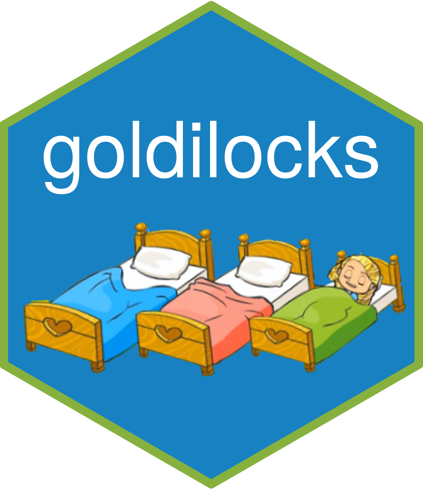

<!-- README.md is generated from README.Rmd. Please edit that file -->

```{r, include = FALSE}
knitr::opts_chunk$set(
  collapse = TRUE,
  comment = "#>",
  fig.path = "man/figures/README-",
  out.width = "100%"
)
```

# goldilocks 

<!-- badges: start -->

[](https://CRAN.R-project.org/package=goldilocks)
[](https://github.com/graemeleehickey/goldilocks/actions/workflows/R-CMD-check.yaml)
[](https://graemeleehickey.github.io/goldilocks/)
[](https://app.codecov.io/gh/graemeleehickey/goldilocks)
[](https://cran.r-project.org/web/checks/check_results_goldilocks.html)
[](https://CRAN.R-project.org/package=goldilocks)
[](https://CRAN.R-project.org/package=goldilocks)
[](https://www.gnu.org/licenses/gpl-3.0)

<!-- badges: end -->

The goal of `goldilocks` is to implement the Goldilocks Bayesian
adaptive design proposed by Broglio et al. (2014), for both one- and
two-arm trials. Outcomes are generated from an underlying
piecewise-exponential event-time model. Final analyses may retain the
time-to-event outcome or reduce complete follow-up to event status at a
fixed endpoint time.

The method can be used for a confirmatory trial to select a trial's
sample size based on accumulating data. During accrual, frequent sample
size selection analyses are made and predictive probabilities are used
to determine whether the current sample size is sufficient or whether
continuing accrual would be futile. The algorithm explicitly accounts
for complete follow-up of all patients before the primary analysis is
conducted. Time-to-event final analyses include the log-rank test, Cox
proportional hazards regression Wald test, and Bayesian
piecewise-exponential inference. Fixed-time binary final analyses include
a frequentist risk-difference Wald test and Bayesian beta-binomial
inference.

Broglio et al. (2014) refer to this as a *Goldilocks trial design*, as
it is constantly asking the question, "Is the sample size too big, too
small, or just right?"

## Endpoint and analysis options

All designs use the piecewise-exponential event-time model for simulation
and predictive imputation. The `method` argument selects the final
analysis:

-   `"logrank"`: log-rank test for a two-arm time-to-event endpoint

-   `"cox"`: Cox model Wald test for a two-arm time-to-event endpoint

-   `"bayes-surv"`: Bayesian piecewise-exponential analysis for one- or
    two-arm time-to-event endpoints

-   `"riskdiff"`: frequentist Wald test for a two-arm fixed-time binary
    event-risk difference

-   `"bayes-bin"`: Bayesian beta-binomial analysis for one- or two-arm
    fixed-time binary endpoints

See the package vignettes for worked two-arm, single-arm, piecewise
survival, and Bayesian binary examples.

## Key benefits

Other software and R packages are available to implement this algorithm.
However, when designing studies it is generally required that many
thousands of trials are simulated to adequately characterize the
operating characteristics, e.g. type I error and power. Hence, a
computationally efficient and fast algorithm is helpful. The
`goldilocks` package takes advantage of many tools to achieve this:

-   Log-rank tests are implemented via a lightweight C++ implementation
    originally from the
    [`fastlogranktest`](https://CRAN.R-project.org/package=fastlogranktest)
    package. Since `fastlogranktest` has been deprecated and removed from
    CRAN, a copy of the C++ source code has been ported directly into
    `goldilocks`

-   Piecewise exponential simulation is implemented via the
    [`PWEALL`](https://CRAN.R-project.org/package=PWEALL) package, which
    uses a lightweight Fortran implementation

-   Simulation of multiple trials can be performed in parallel on Unix-like
    platforms or Windows using R's parallel backends

## References

Broglio KR, Connor JT, Berry SM. Not too big, not too small: a
Goldilocks approach to sample size selection. *Journal of
Biopharmaceutical Statistics*, 2014; **24(3)**: 685–705.

## Installation

The current source release is `goldilocks` 0.6.0.

You can install the released version of `goldilocks` from CRAN with:

```{r eval=FALSE}
install.packages("goldilocks")
```

You can install the current source version from
[GitHub](https://github.com/) with:

```{r eval=FALSE}
# install.packages("devtools")
devtools::install_github("graemeleehickey/goldilocks")
```
