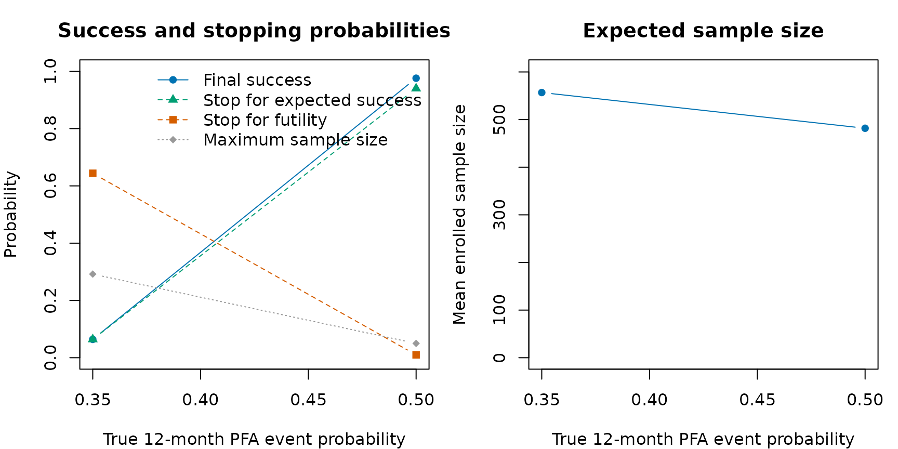
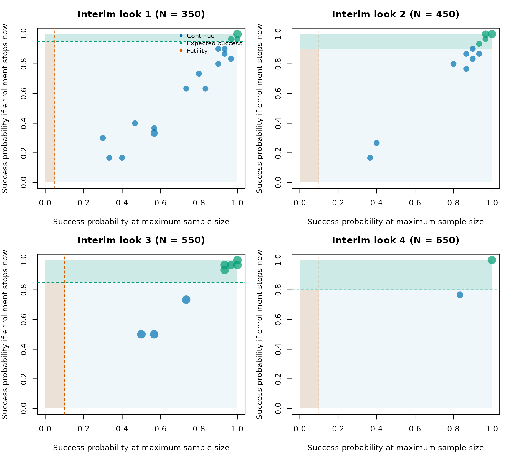

# ADVENT: a published Goldilocks design

``` r

library(goldilocks)
```

The ADVENT trial is a useful published example of a Goldilocks adaptive
sample size design. ADVENT compared pulsed field ablation (PFA) with
conventional thermal ablation for patients with drug-resistant
paroxysmal atrial fibrillation. It was registered as
[NCT04612244](https://clinicaltrials.gov/study/NCT04612244), its design
was published in *Heart Rhythm O2* (Reddy et al., 2023), and its primary
results were published in *The New England Journal of Medicine* (Reddy
et al., 2023).

The design paper states that the sample size was determined adaptively
using a Goldilocks design, citing Broglio et al. (2014). The [ADVENT
statistical analysis plan
(SAP)](https://cdn.clinicaltrials.gov/large-docs/44/NCT04612244/SAP_001.pdf)
clarifies that the possible sizes of the modified intent-to-treat (mITT)
effectiveness population were 350, 450, 550, 650, and 750. At each
enrollment milestone, the trial calculated the predictive probability
that the trial would eventually show noninferiority for both primary
endpoints. The trial could then stop enrollment for predicted success,
stop for futility, or continue to the next milestone.

This vignette uses ADVENT as a worked example for `goldilocks`. It
focuses on how the published design maps to package arguments. The goal
is not to recreate the sponsor’s full statistical analysis plan exactly.
Some details, including site-stratified randomization,
analysis-population exclusions, subject-linked missingness, and the
joint co-primary endpoint stopping rule, are simplified here.

## Trial overview

ADVENT was a multicenter, prospective, single-blind, randomized
controlled noninferiority trial. Randomized subjects were assigned 1:1
to PFA or standard-of-care thermal ablation, where the thermal arm used
either radiofrequency ablation or cryoballoon ablation depending on
site. The first 1 to 3 subjects at each site were nonrandomized roll-in
subjects and are not part of the randomized comparison modeled below.

| Feature | Reported ADVENT design |
|:---|:---|
| Population | Drug-resistant paroxysmal atrial fibrillation |
| Treatment arm | Pulsed field ablation |
| Control arm | Thermal ablation by radiofrequency or cryoballoon ablation |
| Randomization | 1:1 after nonrandomized roll-in subjects |
| Follow-up | 12 months |
| Adaptive sample sizes | 350, 450, 550, 650, or 750 mITT subjects |
| Primary effectiveness endpoint | Treatment success: acute procedural success and freedom from specified chronic failures through 12 months |
| Primary safety endpoint | Composite device- or procedure-related serious adverse events, including selected acute and chronic events |

The final published randomized cohort included 305 subjects assigned to
PFA and 302 assigned to thermal ablation. In the primary results paper,
PFA was noninferior to thermal ablation for both primary effectiveness
and primary safety.

The published design also included a trial-flow figure. The following
diagram recreates the parts of that flow that matter for the package
mapping.

In the code below, roll-in subjects and randomized subjects excluded
from the analysis population are ignored. The simulation starts directly
with the modeled 1:1 analysis population.

## The Goldilocks flow

The ADVENT design paper includes a flowchart for the adaptive sample
size algorithm. The chart below recreates the logic in package terms
rather than copying the published image.

The corresponding `goldilocks` arguments are:

``` r

N_total <- 750
interim_look <- c(350, 450, 550, 650)

Sn <- c(0.95, 0.90, 0.85, 0.80)
Fn <- c(0.05, 0.10, 0.10, 0.10)
```

The mapping is direct:

- `N_total = 750` is the maximum modeled mITT analysis-population size.
- `interim_look = c(350, 450, 550, 650)` supplies the mITT accrual
  milestones at which the Goldilocks decision rule is evaluated. The
  maximum sample size is not included in `interim_look`.
- `Sn` contains the published predicted-success thresholds for sample
  sizes 350, 450, 550, and 650.
- `Fn` contains the published futility thresholds for the same looks.

ADVENT required the predictive probability rule to be favorable for both
co-primary endpoints before enrollment stopped for predicted success,
and unfavorable for either endpoint before stopping for futility. The
current
[`survival_adapt()`](https://graemeleehickey.github.io/goldilocks/reference/survival_adapt.md)
interface models one endpoint per run. In this vignette we therefore run
the effectiveness and safety endpoints separately, then explain how
those separate endpoint-specific runs relate to the reported co-primary
design.

The SAP allowed up to 900 enrolled subjects to obtain 750 mITT subjects:
up to 750 mITT subjects, 105 nonrandomized roll-in subjects, and 45
randomized subjects who did not enter the mITT population. The package
examples below start directly with the analysis population and do not
simulate roll-ins or post-randomization exclusions.

## Endpoint scale

ADVENT reported the primary effectiveness endpoint as treatment success
at 12 months. The beta-binomial method in `goldilocks` is parameterized
on the binary event probability. For the effectiveness endpoint we
therefore code the event as failure by 12 months:

p\_{\text{failure}} = 1 - p\_{\text{treatment success}}.

The design paper reports a target scenario with 65% treatment success in
each arm. On the event scale used in the code, that corresponds to a 35%
failure probability in each arm.

For the safety endpoint, the event is already an adverse event. The
target scenario was an 8% primary safety event rate in each arm.

| Endpoint | Published scale | Code event | Target event probability | Noninferiority margin | Posterior threshold |
|:---|:---|:---|---:|---:|---:|
| Effectiveness | Treatment success by 12 months | Failure to meet treatment success | 0.35 | 0.15 | 0.956 |
| Safety | Primary safety event by 12 months | Primary safety event | 0.08 | 0.08 | 0.966 |

The ADVENT primary analyses used Bayesian beta-binomial endpoint models
with noninformative \operatorname{Beta}(0.5, 0.5) priors. In
`goldilocks`, this is specified with:

``` r

bin_prior <- c(0.5, 0.5)
```

The `prior` argument still appears in the code below because
[`survival_adapt()`](https://graemeleehickey.github.io/goldilocks/reference/survival_adapt.md)
uses a time-to-event model to impute not-yet-observed outcomes at
interim looks. That imputation model uses a Gamma prior on
piecewise-exponential hazards. The ADVENT SAP specifies a noninformative
\operatorname{Gamma}(0.5, 0.001) shape-rate prior for most of those
hazards. We use those reported hyperparameters here rather than the
package default. Because the SAP expresses the corresponding risk sets
and exposure in patient-days, every time supplied to `goldilocks` below
is expressed in days:

``` r

prior <- c(0.5, 0.001)
```

That distinction is important: `bin_prior` is the ADVENT-aligned
endpoint prior, whereas `prior` controls the package’s predictive
imputation model.

The effectiveness model in the SAP needs one further qualification. It
partitions follow-up at days 90, 104, 150, and 210. For interim
sample-size prediction, the first four interval hazards use
\operatorname{Gamma}(0.5, 0.001) priors, but the 210–360-day hazard uses
an informative \operatorname{Gamma}(5, 10000) prior because little late
follow-up was expected at the interim assessments. The final
multiple-imputation analysis returns to \operatorname{Gamma}(0.5, 0.001)
for every interval. The current `goldilocks` interface applies one
shared Gamma prior to every interval and uses it for both interim
prediction and final imputation, so the special 210–360-day prior is not
yet available in the package. We therefore use \operatorname{Gamma}(0.5,
0.001) throughout this endpoint-specific illustration.

Later follow-up intervals can have no exposure at an early look. The
SAP’s conjugate model then leaves the corresponding hazard governed by
its prior. The package’s historical default instead propagates
sufficient statistics from a neighboring interval, so the examples
explicitly set `empty_interval = "prior"`.

The SAP reports M = 5000 completed datasets for its
predictive-probability and multiple-imputation calculations. The
evaluated parts of this vignette deliberately use fewer imputations: 50
for the worked single trials and 30 for the operating-characteristic
example. We do not use M = 5000 in evaluated code in order to keep
vignette computation time to a minimum. The unevaluated fuller template
does use M = 5000 to show the ADVENT setting. Consequently, the
numerical results shown in the vignette are demonstrations of package
workflow rather than reproductions of the ADVENT calibration.

## SAP event-time models and time units

The SAP provides the exact default piecewise-exponential generators used
in its operating-characteristic simulations. Because their hazards are
expressed per patient-day and their Gamma prior rates use patient-day
exposure, this vignette uses **days as the single numeric time unit
supplied to `goldilocks`**. The SAP also treats 30 days as one
simulation month, so 12 months is represented as 360 days.

``` r

days_per_month <- 30L
follow_up_months <- 12L
end_of_study_day <- follow_up_months * days_per_month

eff_event_cutpoints_day <- c(90, 104, 150, 210)
eff_hazard_per_day <- c(
  0.000111670,
  0.002197976,
  0.003163208,
  0.002839089,
  0.000494053
)

safety_event_cutpoints_day <- 7
safety_hazard_per_day <- c(0.011137363, 1.53540e-5)

event_free_at_interval_end <- function(hazard, interval_end) {
  vapply(seq_along(hazard), function(j) {
    cutpoints <- if (j == 1L) NULL else interval_end[seq_len(j - 1L)]
    post <- array(hazard[seq_len(j)], dim = c(1L, j, 1L))

    1 - goldilocks:::haz_to_prop(
      post = post,
      cutpoints = cutpoints,
      end_of_study = interval_end[j],
      single_arm = TRUE
    )$p_treatment
  }, numeric(1))
}

implied_event_free_proportion <- c(
  event_free_at_interval_end(
    eff_hazard_per_day,
    c(eff_event_cutpoints_day, end_of_study_day)
  ),
  event_free_at_interval_end(
    safety_hazard_per_day,
    c(safety_event_cutpoints_day, end_of_study_day)
  )
)

hazard_table <- data.frame(
  Endpoint = c(rep("Effectiveness failure", 5), rep("Safety event", 2)),
  `Follow-up interval (days)` = c(
    "0--<90", "90--<104", "104--<150", "150--<210",
    "210--360", "0--<7", "7--360"
  ),
  `Hazard per patient-day` = c(
    eff_hazard_per_day,
    safety_hazard_per_day
  ),
  `Implied event-free proportion at interval end` =
    implied_event_free_proportion,
  check.names = FALSE
)

knitr::kable(hazard_table, digits = c(9, 3))
```

| Endpoint | Follow-up interval (days) | Hazard per patient-day | Implied event-free proportion at interval end |
|:---|:---|---:|---:|
| Effectiveness failure | 0–\<90 | 0.000111670 | 0.990 |
| Effectiveness failure | 90–\<104 | 0.002197976 | 0.960 |
| Effectiveness failure | 104–\<150 | 0.003163208 | 0.830 |
| Effectiveness failure | 150–\<210 | 0.002839089 | 0.700 |
| Effectiveness failure | 210–360 | 0.000494053 | 0.650 |
| Safety event | 0–\<7 | 0.011137363 | 0.925 |
| Safety event | 7–360 | 0.000015354 | 0.920 |

The less-than sign marks the exclusive upper boundary of each nonfinal
interval; the final interval includes the administrative endpoint at day
360. This notation makes clear that adjacent windows do not overlap.
Because event time is continuous, assigning an exact cut-point to the
interval on its left or right would not change the model probability.

The following calculation verifies the two final binary event
probabilities used by the vignette:

``` r

prob_check <- data.frame(
  Endpoint = c("Effectiveness failure", "Safety event"),
  `SAP target event probability at day 360` = c(0.35, 0.08),
  `Calculated event probability at day 360` = c(
    ppwe(
      hazard = matrix(eff_hazard_per_day, nrow = 1),
      end_of_study = end_of_study_day,
      cutpoints = eff_event_cutpoints_day
    ),
    ppwe(
      hazard = matrix(safety_hazard_per_day, nrow = 1),
      end_of_study = end_of_study_day,
      cutpoints = safety_event_cutpoints_day
    )
  ),
  check.names = FALSE
)

knitr::kable(prob_check, digits = 6)
```

| Endpoint | SAP target event probability at day 360 | Calculated event probability at day 360 |
|:---|---:|---:|
| Effectiveness failure | 0.35 | 0.35 |
| Safety event | 0.08 | 0.08 |

For a piecewise-exponential model with interval hazards \lambda_j and
interval lengths d_j, the cumulative hazard through day 360 is

H(360) = \sum_j \lambda_j d_j,

and the implied day-360 event probability is

p = 1 - \exp\\-H(360)\\.

To obtain a target event probability p^\* while retaining the relative
height of every piece, multiply each hazard by

c = \frac{-\log(1-p^\*)}{H(360)}, \qquad \lambda_j^\* = c\lambda_j.

When the treatment hazard vector is obtained by scaling the control
vector this way, the hazard ratio is the same constant c in every
interval. Thus, the operation preserves the piecewise shape and imposes
proportional hazards in data generation. We use it for the
noninferiority-boundary examples below:

``` r

scale_pwe_to_event_probability <- function(
  hazard_per_day,
  cutpoints_day,
  end_day,
  target_event_probability
) {
  interval_length_day <- diff(c(0, cutpoints_day, end_day))
  cumulative_hazard <- sum(hazard_per_day * interval_length_day)
  scale <- -log1p(-target_event_probability) / cumulative_hazard
  hazard_per_day * scale
}

eff_margin_hazard_per_day <- scale_pwe_to_event_probability(
  eff_hazard_per_day,
  eff_event_cutpoints_day,
  end_of_study_day,
  target_event_probability = 0.50
)

safety_margin_hazard_per_day <- scale_pwe_to_event_probability(
  safety_hazard_per_day,
  safety_event_cutpoints_day,
  end_of_study_day,
  target_event_probability = 0.16
)
```

Two time clocks remain conceptually distinct even though both are
represented in days. Event cut-points are subject-relative follow-up
times; enrollment-rate change points below are trial-calendar times
measured from first patient in. In addition, the SAP’s event clock
starts on the index-procedure date, whereas `goldilocks` starts it at
enrollment/randomization. This vignette treats those dates as coincident
and does not model a randomization-to-procedure delay.

## Effectiveness endpoint

For the effectiveness endpoint, success in the code means:

\Pr(p\_{\text{PFA failure}} - p\_{\text{thermal failure}} \< 0.15 \mid
\text{data}) \> 0.956.

This matches the reported 15 percentage point absolute noninferiority
margin for treatment success, after translating success into failure. A
lower failure probability is better, so we use `alternative = "less"`.

ADVENT used 1:1 randomization stratified by site. The design paper
reports randomly varying permuted block sizes, but the SAP does not
provide the block sizes or the randomization-generation algorithm. The
package can generate blocked 1:1 randomization, but it does not model
site-level stratification or randomly varying block sizes. Here
`block = 2` and `rand_ratio = c(1, 1)` retain simple 1:1 balance; they
do not reproduce the trial’s full randomization scheme.

The SAP explicitly designates 5% of subjects as lost to follow-up for
safety and 7.5% for effectiveness: the same 5% plus another 2.5% who may
be unassessable for effectiveness while remaining assessable for safety.
SAP dropout times are uniform over days 0–360, and an event remains
observed when it precedes dropout. The package’s `prop_loss` mechanism
is similar but not identical: every selected subject is censored at a
uniformly generated time before their potential event or administrative
censoring time. Separate endpoint runs also cannot preserve the SAP’s
shared subject-level 5% plus nested 2.5% relationship. We therefore use
0.075 and 0.05 to map the SAP’s **designated fractions**, not to claim
exact reproduction of its censoring process. The subsequently observed
proportion not completing follow-up was approximately 0.04, which is
close to 0.05, but that post-trial quantity is not the design input and
need not equal endpoint-specific missingness.

The SAP reports the expected accrual schedule in subjects per month: 2,
5, 10, 15, 20, 25, and 30 during months 1–7, then 33 per month from
month 8 onward. Accrual is into the primary analysis population. The
source rates remain visibly labeled per month below, but they are
divided by 30 exactly once before being supplied to `goldilocks`.
Likewise, the calendar-month change points are converted once to days
since first patient in. The SAP does not describe its individual
arrival-time generator; `goldilocks` uses these rates in a
continuous-time Poisson enrollment process with first patient in fixed
at calendar day 0.

``` r

enrollment_rate_per_month <- c(2, 5, 10, 15, 20, 25, 30, 33)
enrollment_rate_change_month <- 1:7

enrollment_rate_per_day <- enrollment_rate_per_month / days_per_month
enrollment_rate_change_day <-
  enrollment_rate_change_month * days_per_month

effectiveness_prop_loss <- 0.075
safety_prop_loss <- 0.05

enrollment_schedule <- data.frame(
  `Trial-calendar interval (months)` = c(
    paste("Month", 1:7),
    "Month 8 onward"
  ),
  `Trial-calendar interval (days since first patient in)` = c(
    paste0(
      (0:6) * days_per_month,
      "--<",
      (1:7) * days_per_month
    ),
    paste0(7 * days_per_month, " onward")
  ),
  `SAP rate (subjects/month)` = enrollment_rate_per_month,
  `Rate supplied to goldilocks (subjects/day)` = enrollment_rate_per_day,
  check.names = FALSE
)

knitr::kable(enrollment_schedule, digits = 4)
```

| Trial-calendar interval (months) | Trial-calendar interval (days since first patient in) | SAP rate (subjects/month) | Rate supplied to goldilocks (subjects/day) |
|:---|:---|---:|---:|
| Month 1 | 0–\<30 | 2 | 0.0667 |
| Month 2 | 30–\<60 | 5 | 0.1667 |
| Month 3 | 60–\<90 | 10 | 0.3333 |
| Month 4 | 90–\<120 | 15 | 0.5000 |
| Month 5 | 120–\<150 | 20 | 0.6667 |
| Month 6 | 150–\<180 | 25 | 0.8333 |
| Month 7 | 180–\<210 | 30 | 1.0000 |
| Month 8 onward | 210 onward | 33 | 1.1000 |

Thus, for example, trial-calendar day 210 is the beginning of month 8
and the 33-subject/month rate. It is unrelated to the effectiveness
endpoint’s subject-relative cut-point at follow-up day 210. The 360-day
follow-up horizon is also per subject, not the total duration of the
trial. Accrual speed remains worth sensitivity checking: faster accrual
reduces the amount of observed endpoint information available at interim
looks.

The following
[`survival_adapt()`](https://graemeleehickey.github.io/goldilocks/reference/survival_adapt.md)
call simulates and analyzes the effectiveness endpoint for **one
simulated trial**. It does not estimate operating characteristics over
multiple trials.

``` r

set.seed(4601)

# One simulated effectiveness-endpoint trial
advent_effectiveness <- survival_adapt(
  hazard_treatment = eff_hazard_per_day,
  hazard_control = eff_hazard_per_day,
  cutpoints = eff_event_cutpoints_day,
  N_total = N_total,
  lambda = enrollment_rate_per_day,
  lambda_time = enrollment_rate_change_day,
  interim_look = interim_look,
  end_of_study = end_of_study_day,
  prior = prior,
  bin_prior = bin_prior,
  bin_method = "quadrature",
  block = 2,
  rand_ratio = c(1, 1),
  prop_loss = effectiveness_prop_loss,
  alternative = "less",
  h0 = 0.15,
  Fn = Fn,
  Sn = Sn,
  prob_ha = 0.956,
  N_impute = 50,
  empty_interval = "prior",
  method = "bayes-bin",
  imputed_final = TRUE
)

advent_effectiveness
#>   prob_threshold margin alternative N_treatment N_control N_enrolled N_max
#> 1          0.956   0.15        less         225       225        450   750
#>   post_prob_ha     est_final ppp_success stop_futility stop_expected_success
#> 1    0.9994649 -0.0007079646        0.98             0                     1
```

The most important columns are:

- `N_enrolled`: the selected sample size for this simulated trial.
- `stop_expected_success`: whether enrollment stopped because the
  current sample size appeared adequate.
- `stop_futility`: whether enrollment stopped because success looked
  unlikely even at the maximum sample size.
- `est_final`: the posterior mean of p\_{\text{PFA failure}} -
  p\_{\text{thermal failure}}.
- `post_prob_ha`: the final posterior probability that the binary
  endpoint effect is below the noninferiority margin.

## Safety endpoint

The safety endpoint uses the same Goldilocks sample-size rule, but
changes the event probability, margin, and posterior probability
threshold. Success in the code means:

\Pr(p\_{\text{PFA safety event}} - p\_{\text{thermal safety event}} \<
0.08 \mid \text{data}) \> 0.966.

This
[`survival_adapt()`](https://graemeleehickey.github.io/goldilocks/reference/survival_adapt.md)
call likewise represents **one simulated trial** for the safety
endpoint.

``` r

set.seed(4602)

# One simulated safety-endpoint trial
advent_safety <- survival_adapt(
  hazard_treatment = safety_hazard_per_day,
  hazard_control = safety_hazard_per_day,
  cutpoints = safety_event_cutpoints_day,
  N_total = N_total,
  lambda = enrollment_rate_per_day,
  lambda_time = enrollment_rate_change_day,
  interim_look = interim_look,
  end_of_study = end_of_study_day,
  prior = prior,
  bin_prior = bin_prior,
  bin_method = "quadrature",
  block = 2,
  rand_ratio = c(1, 1),
  prop_loss = safety_prop_loss,
  alternative = "less",
  h0 = 0.08,
  Fn = Fn,
  Sn = Sn,
  prob_ha = 0.966,
  N_impute = 50,
  empty_interval = "prior",
  method = "bayes-bin",
  imputed_final = TRUE
)

advent_safety
#>   prob_threshold margin alternative N_treatment N_control N_enrolled N_max
#> 1          0.966   0.08        less         325       325        650   750
#>   post_prob_ha  est_final ppp_success stop_futility stop_expected_success
#> 1    0.9988901 0.01815951           1             0                     1
```

In the published ADVENT design, a predicted-success stopping
recommendation required high predictive probability for both endpoints.
A futility recommendation could be triggered by low predictive
probability for either endpoint. The two separate simulations above do
not impose that joint rule. Instead, they show how each
endpoint-specific Bayesian rule maps to
[`survival_adapt()`](https://graemeleehickey.github.io/goldilocks/reference/survival_adapt.md).

## A compact design object

For simulations, it is helpful to collect the settings that genuinely
are common and then add endpoint-specific cut-points and designated
missingness fractions. Keeping those endpoint-specific arguments out of
the common object prevents an effectiveness setting from being reused
accidentally for safety, or vice versa.

``` r

advent_common <- list(
  N_total = N_total,
  lambda = enrollment_rate_per_day,
  lambda_time = enrollment_rate_change_day,
  interim_look = interim_look,
  end_of_study = end_of_study_day,
  prior = prior,
  bin_prior = bin_prior,
  bin_method = "quadrature",
  block = 2,
  rand_ratio = c(1, 1),
  alternative = "less",
  Fn = Fn,
  Sn = Sn,
  N_impute = 30,
  empty_interval = "prior",
  method = "bayes-bin",
  imputed_final = TRUE,
  ncores = 2
)

advent_effectiveness_args <- modifyList(advent_common, list(
  cutpoints = eff_event_cutpoints_day,
  prop_loss = effectiveness_prop_loss
))

advent_safety_args <- modifyList(advent_common, list(
  cutpoints = safety_event_cutpoints_day,
  prop_loss = safety_prop_loss
))

advent_effectiveness_args
#> $N_total
#> [1] 750
#> 
#> $lambda
#> [1] 0.06666667 0.16666667 0.33333333 0.50000000 0.66666667 0.83333333 1.00000000
#> [8] 1.10000000
#> 
#> $lambda_time
#> [1]  30  60  90 120 150 180 210
#> 
#> $interim_look
#> [1] 350 450 550 650
#> 
#> $end_of_study
#> [1] 360
#> 
#> $prior
#> [1] 0.500 0.001
#> 
#> $bin_prior
#> [1] 0.5 0.5
#> 
#> $bin_method
#> [1] "quadrature"
#> 
#> $block
#> [1] 2
#> 
#> $rand_ratio
#> [1] 1 1
#> 
#> $alternative
#> [1] "less"
#> 
#> $Fn
#> [1] 0.05 0.10 0.10 0.10
#> 
#> $Sn
#> [1] 0.95 0.90 0.85 0.80
#> 
#> $N_impute
#> [1] 30
#> 
#> $empty_interval
#> [1] "prior"
#> 
#> $method
#> [1] "bayes-bin"
#> 
#> $imputed_final
#> [1] TRUE
#> 
#> $ncores
#> [1] 2
#> 
#> $cutpoints
#> [1]  90 104 150 210
#> 
#> $prop_loss
#> [1] 0.075
```

Then the endpoint-specific simulation calls become short:

``` r

set.seed(4610)

eff_target <- do.call(sim_trials, c(
  advent_effectiveness_args,
  list(
    N_trials = 500,
    hazard_treatment = eff_hazard_per_day,
    hazard_control = eff_hazard_per_day,
    h0 = 0.15,
    prob_ha = 0.956,
    return_trace = TRUE,
    seed = 4610
  )
))

eff_null_boundary <- do.call(sim_trials, c(
  advent_effectiveness_args,
  list(
    N_trials = 500,
    hazard_treatment = eff_margin_hazard_per_day,
    hazard_control = eff_hazard_per_day,
    h0 = 0.15,
    prob_ha = 0.956,
    seed = 4611
  )
))

oc_small <- summarise_sims(list(
  "target: equal 35% failure" = eff_target$sims,
  "margin: PFA failure 50%" = eff_null_boundary$sims
))

knitr::kable(oc_small, digits = 3)
```

| scenario | power | stop_success | stop_futility | stop_max_N | mean_N | sd_N | stop_and_fail |
|:---|---:|---:|---:|---:|---:|---:|---:|
| margin: PFA failure 50% | 0.064 | 0.064 | 0.644 | 0.292 | 556.8 | 151.789 | 0.040 |
| target: equal 35% failure | 0.976 | 0.940 | 0.010 | 0.050 | 481.8 | 112.223 | 0.012 |

Each scenario uses 500 simulated trials and two cores. This remains a
workflow demonstration rather than a definitive estimate of power or
type I error. For design work, increase `N_trials`, increase `N_impute`,
and run sensitivity analyses over accrual speed, loss to follow-up,
event rates, and the imputation hazard model.

## Visualizing the simulated design

The plotting helpers answer complementary design questions. First,
[`plot_sim_ocs()`](https://graemeleehickey.github.io/goldilocks/reference/plot_sim_ocs.md)
compares operating characteristics across the target and
noninferiority-margin scenarios. The true PFA event probability is
supplied as the effect scale.

``` r

oc_small$true_pfa_event_probability <- c(0.35, 0.50)
plot_sim_ocs(
  oc_small,
  effect = "true_pfa_event_probability",
  xlab = "True 12-month PFA event probability"
)
```



Within the target scenario,
[`plot_sim_stopping()`](https://graemeleehickey.github.io/goldilocks/reference/plot_sim_stopping.md)
shows how often each sample size is selected and why enrollment stops.

``` r

plot_sim_stopping(eff_target)
```


Because `eff_target` was simulated with `return_trace = TRUE`, its
interim decision geometry can also be inspected. Each displayed panel
corresponds to an ADVENT enrollment milestone reached in at least one
simulated trial; larger bubbles represent predictive-probability pairs
reached by more simulated trials.

``` r

plot_sim_decisions(eff_target)
```



## A fuller simulation template

The following code is closer to what one would run outside the vignette
build. It is not evaluated here.

``` r

advent_effectiveness_full_args <- modifyList(advent_effectiveness_args, list(
  N_impute = 5000,
  ncores = 8
))

advent_safety_full_args <- modifyList(advent_safety_args, list(
  N_impute = 5000,
  ncores = 8
))

eff_target_full <- do.call(sim_trials, c(
  advent_effectiveness_full_args,
  list(
    N_trials = 1000,
    hazard_treatment = eff_hazard_per_day,
    hazard_control = eff_hazard_per_day,
    h0 = 0.15,
    prob_ha = 0.956,
    seed = 4620
  )
))

eff_margin_full <- do.call(sim_trials, c(
  advent_effectiveness_full_args,
  list(
    N_trials = 1000,
    hazard_treatment = eff_margin_hazard_per_day,
    hazard_control = eff_hazard_per_day,
    h0 = 0.15,
    prob_ha = 0.956,
    seed = 4621
  )
))

safety_target_full <- do.call(sim_trials, c(
  advent_safety_full_args,
  list(
    N_trials = 1000,
    hazard_treatment = safety_hazard_per_day,
    hazard_control = safety_hazard_per_day,
    h0 = 0.08,
    prob_ha = 0.966,
    seed = 4622
  )
))

safety_margin_full <- do.call(sim_trials, c(
  advent_safety_full_args,
  list(
    N_trials = 1000,
    hazard_treatment = safety_margin_hazard_per_day,
    hazard_control = safety_hazard_per_day,
    h0 = 0.08,
    prob_ha = 0.966,
    seed = 4623
  )
))

summarise_sims(list(
  "effectiveness target" = eff_target_full$sims,
  "effectiveness margin" = eff_margin_full$sims,
  "safety target" = safety_target_full$sims,
  "safety margin" = safety_margin_full$sims
))
```

The “margin” scenarios above set the treatment event probability equal
to the control event probability plus the noninferiority margin. They
are useful for checking false-positive behavior near the design
boundary. They are not the only null scenarios worth studying.

## SAP sensitivity assumptions and reference benchmarks

The SAP assessed whether operating characteristics were robust to
several alternative assumptions. In `goldilocks` notation, these
correspond to:

- Varying the day-360 event probability implied by the effectiveness
  `hazard_control` vector over `c(0.40, 0.35, 0.30)`. These are failure
  probabilities and therefore correspond to the SAP’s control success
  probabilities of 0.60, 0.65, and 0.70. The day-360 event probability
  implied by the safety `hazard_control` vector was varied over
  `c(0.06, 0.08, 0.10)`.
- Supplying a slower `lambda` schedule of
  `c(2, 5, 10, 10, 15, 15, 20, 25) / 30`, with
  `lambda_time = (1:7) * 30`, or a faster schedule of
  `c(5, 10, 20, 25, 30, 40, 50) / 30`, with `lambda_time = (1:6) * 30`.
  Division by 30 converts the SAP’s subjects/month rates to the
  subjects/day scale used here.
- Using the SAP’s second effectiveness generator with
  `cutpoints = c(90, 100, 200, 300)` and both `hazard_treatment` and
  `hazard_control` set to
  `c(0.000055695, 0.010034797, 0.001690763, 0.000680535, 0.000573122)`
  in its equal-arm target scenario.
- Using the SAP’s third effectiveness generator with
  `cutpoints = c(90, 120)` and both hazard arguments set to
  `c(0.000569925, 0.007879626, 0.000596254)` in its equal-arm target
  scenario.
- Using the SAP’s second safety generator with `cutpoints = c(7, 180)`
  and both hazard arguments set to
  `c(0.007327613, 0.000122991, 0.0000600610)` in its equal-arm target
  scenario.

The three alternative event-time generators deliberately use
data-generating partitions that differ from the principal analysis
partitions. The current package accepts one `cutpoints` vector for both
event generation and predictive imputation, so it cannot reproduce those
model-misspecification sensitivities directly. The SAP also planned an
imputation-model sensitivity with six pieces: day 90 followed by five
post-90-day intervals containing approximately equal event counts,
potentially with different cut-points by arm. A shared fixed package
cut-point vector cannot reproduce that analysis either.

The SAP supplies quantitative reference results based on 10,000
simulated trials per scenario and M=5000 predictive draws or
imputations:

| Scenario | Reported probability | Probability meaning | Mean mITT sample size |
|:---|---:|:---|---:|
| Target: both endpoints at expected rates | 0.9635 | Joint power | 504 |
| Effectiveness noninferiority boundary | 0.0487 | Effectiveness type I error | 551 |
| Safety noninferiority boundary | 0.0528 | Safety type I error | 457 |

The target row sets the effectiveness `hazard_treatment` and
`hazard_control` vectors to imply equal day-360 failure probabilities of
0.35, and the safety hazard vectors to imply equal day-360 event
probabilities of 0.08; success requires both co-primary endpoints. At
the effectiveness boundary, `hazard_treatment` implies a 0.50 failure
probability while `hazard_control` implies 0.35, and the safety endpoint
was assumed always to recommend stopping for promise and to pass
finally. At the safety boundary, the treatment and control safety
hazards imply event probabilities of 0.16 and 0.08, respectively, and
effectiveness was treated analogously. These are external validation
targets. The endpoint-separated simulations in this vignette do not
claim to reproduce them.

## References

Broglio KR, Connor JT, Berry SM. Not too big, not too small: a
Goldilocks approach to sample size selection. *Journal of
Biopharmaceutical Statistics*. 2014;24(3):685-705.
<doi:10.1080/10543406.2014.888569>.

Reddy VY, Gerstenfeld EP, Natale A, et al. A randomized controlled trial
of pulsed field ablation versus standard-of-care ablation for paroxysmal
atrial fibrillation: The ADVENT trial rationale and design. *Heart
Rhythm O2*. 2023;4(5):317-328. <doi:10.1016/j.hroo.2023.03.001>.

Reddy VY, Gerstenfeld EP, Natale A, et al. Pulsed field or conventional
thermal ablation for paroxysmal atrial fibrillation. *New England
Journal of Medicine*. 2023;389(18):1660-1671.
<doi:10.1056/NEJMoa2307291>.

ClinicalTrials.gov. A prospective randomized pivotal trial of the
FARAPULSE pulsed field ablation system compared with standard of care
ablation in patients with paroxysmal atrial fibrillation. NCT04612244.

FARAPULSE, Inc. *ADVENT Statistical Analysis Plan*. CS0935 Rev C. 12
October 2021. Available from the [ClinicalTrials.gov document
archive](https://cdn.clinicaltrials.gov/large-docs/44/NCT04612244/SAP_001.pdf).
