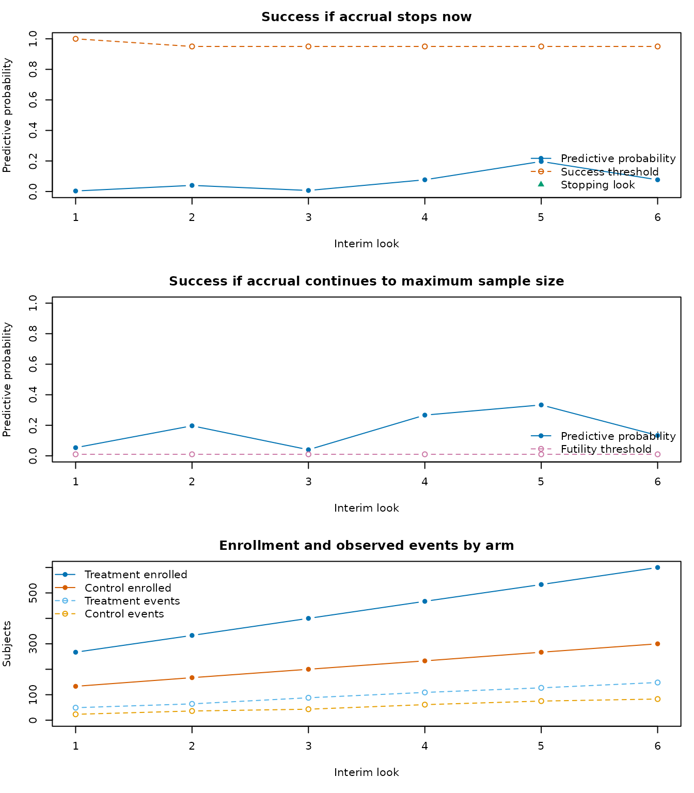

# ANTHEM-HFrEF: a published adaptive survival design

``` r

library(goldilocks)
```

The ANTHEM-HFrEF pivotal study is a published example of Bayesian
predictive sample-size adaptation paired with a conventional frequentist
final analysis. The trial compared vagal nerve stimulation (VNS) plus
guideline-directed medical therapy (GDMT) with GDMT alone in patients
with heart failure and reduced ejection fraction. It was registered as
[NCT03425422](https://clinicaltrials.gov/study/NCT03425422), its design
was published by Konstam et al. (2019), and its results were published
by Konstam et al. (2026).

This vignette maps the morbidity and mortality component of the planned
design to `goldilocks`. It is an explicit approximation, not a
reconstruction or validation of the sponsor’s implementation. The public
protocol, statistical analysis plan (SAP), and Adaptive Design Report
(ADR) disclose substantially more detail than the journal articles
alone, including the predictive model, priors, simulation profiles, and
reference operating characteristics. Even with those documents,
differences between the sponsor’s algorithm and the current package API
remain important and are identified below.

## Clinical question and planned analysis

ANTHEM-HFrEF randomized patients 2:1 to VNS plus GDMT or GDMT alone. The
primary efficacy endpoint was time from randomization to cardiovascular
death or first heart-failure hospitalization. The planned maximum sample
size was 1,000 patients, and the final primary analysis was a one-sided
log-rank test. Superiority required a one-sided *P* value no larger than
0.019. That nominal level was calibrated by simulation so that the
overall one-sided type I error, including the adaptive decisions, did
not exceed 0.025.

At an interim update, the design calculated two predictive
probabilities:

- \mathrm{PPS}\_n: probability that the final log-rank test would
  succeed if enrollment stopped at the current sample size and follow-up
  continued;
- \mathrm{PPS}\_{\mathrm{max}}: probability that the final log-rank test
  would succeed if enrollment continued to 1,000 patients.

Futility monitoring began at the first update, nominally at 400
randomized patients, and stopped the trial if
\mathrm{PPS}\_{\mathrm{max}} \< 0.01. Expected-success monitoring began
at 500 patients and stopped enrollment if \mathrm{PPS}\_n \> 0.95.
Enrollment-based updates then recurred after every additional 100
patients through 1,000. The reported 400-patient update also required at
least 300 patients to have nine months since randomization, and the
design included additional futility updates four and eight months after
the last patient was randomized.

The asterisk on 400 denotes the additional nine-month-information
condition. The chart focuses on the morbidity and mortality sample-size
rule; the trial also had safety, symptom, function, and regulatory
decision criteria that are outside this package example.

## Planned design versus operational history

The adaptive design and what actually happened must be kept separate.
The registry reports 533 randomized patients. The final report excluded
one incorrect randomization from the intent-to-treat population, leaving
532 evaluable randomized patients. After the second interim analysis,
the data monitoring committee recommended continuing the trial
unchanged, but the sponsor stopped enrollment and closed the program for
reasons outside the prespecified efficacy and futility rules. The
published primary endpoint was neutral (hazard ratio 0.84, one-sided *P*
= 0.115). Nothing in the simulations below represents or attempts to
reproduce that operational decision or the observed patient data.

## Source and status of every modeled input

The status labels have the following meanings:

- **reported**: stated numerically in a public primary source;
- **inferred**: calculated from, or used to encode, reported
  information;
- **assumed**: selected for this runnable package example;
- **unavailable**: needed for exact reproduction but not publicly
  supplied.

| Input | Value | Status | Source_and_mapping |
|:---|:---|:---|:---|
| N_total | 1000 | reported | ADR Sections 1.2 and 3 |
| interim_look | 400, 500, 600, 700, 800, 900 | reported | ADR Section 3; maximum N is not an interim_look in goldilocks |
| end_of_study | 16 months (69.33 weeks) | reported | ADR Sections 1.4.1 and 3.3 |
| rand_ratio | 1 control : 2 treatment | reported | ADR Section 1.2; package order is control, treatment |
| block | 3 | assumed | ADR reports varying blocks of 3, 6, or 9; fixed 3 is the closest API setting |
| lambda, lambda_time | Six-step ramp to 26 patients/month | inferred | ADR Sections 5.2 and 7 report a six-month ramp to a peak of 26/month |
| cutpoints | 6 and 12 months | reported | ADR Section 2.1 reports 0-6, 6-12, 12-18, and \>18 month intervals; the 16-month package horizon uses the first two cut-points |
| hazard_control | 0.00828, 0.00828, 0.00240 events/week | reported | ADR Table 5, one-year control event probability 0.35; the 0-12 month rate is repeated across the 6-month analysis cut-point |
| hazard_treatment | 0.70 x control hazard | inferred | ADR Sections 5.1 and 7 report the target hazard-ratio scenario |
| prop_loss | 0.10 | reported | ADR Sections 5.3 and 7.2 |
| prior_surv | Gamma shapes 1; rates 1/0.0069, 1/0.0069, 1/0.0035 | reported | ADR Table 1; goldilocks applies these independent priors to both arms |
| alternative | less | reported | ADR Equation 1 defines lower treatment hazard as benefit |
| h0 | 0 | reported | ADR Equation 1 uses equality of survival distributions |
| Fn | 0.01 at every modeled look | reported | ADR Section 3.2 |
| Sn | 1.00 at N=400; 0.95 at N=500,…,900 | inferred | ADR Section 3.3; 1.00 disables package success stopping at N=400 |
| prob_ha | 0.981 | inferred | 1 minus the reported one-sided P-value threshold of 0.019 |
| method | logrank | reported | ADR Section 1.4.1 |
| imputed_final | FALSE | inferred | The reported final analysis uses observed right-censored data |
| N_impute | 300 evaluated; 10000 in the fuller template | assumed | Runtime setting; 300 is the smallest draw count whose 95% one-sided upper bound at zero successes is below 0.01; ADR uses at least 10000 live and 1000 in simulations |
| mc_conf_level | 0.95 | assumed | Package Monte Carlo decision guard; not part of the reported rule |
| empty_interval | prior | assumed | Package policy; later empty intervals remain prior-driven |
| return_trace | TRUE for the worked trial | assumed | Retains a compact example decision path |
| N_trials | 20 per evaluated scenario | assumed | Runtime setting for a smoke-test operating-characteristic comparison |
| ncores | 2 | assumed | Runtime setting |
| Sponsor software modifications and random-number seeds | Not supplied | unavailable | ADR Section 5.5 identifies a modified FACTS 5.8.7 engine but does not publish its code or seeds |

## Event-time and accrual assumptions

The ADR’s control-arm simulation profile with a 35% one-year event
probability used weekly hazards 0.00828 through month 12, 0.00240 from
months 12 to 24, and 0.00012 thereafter. This profile implies a
three-year event probability close to the 43% planning value summarized
in the final paper:

``` r

weeks_per_month <- 52 / 12

sponsor_control_hazard_week <- c(0.00828, 0.00240, 0.00012)
sponsor_interval_length_week <- rep(52, 3)
control_event_probability_3y <- 1 - exp(-sum(
  sponsor_control_hazard_week * sponsor_interval_length_week
))

data.frame(
  Quantity = c("One-year control event probability", "Three-year control event probability"),
  Value = c(
    1 - exp(-0.00828 * 52),
    control_event_probability_3y
  )
)
#>                               Quantity     Value
#> 1   One-year control event probability 0.3498551
#> 2 Three-year control event probability 0.4297041
```

The package uses one cut-point vector for both data generation and
predictive imputation. We retain the reported predictive cut-points at 6
and 12 months, repeat the reported 0-12-month generating hazard on
either side of the 6-month cut-point, and truncate at the package’s
16-month subject-level horizon.

``` r

analysis_cutpoints_week <- c(6, 12) * weeks_per_month
end_of_study_week <- 16 * weeks_per_month

hazard_control_week <- c(0.00828, 0.00828, 0.00240)
hazard_treatment_target_week <- 0.70 * hazard_control_week
hazard_treatment_null_week <- hazard_control_week

prior_surv_approx <- rbind(
  shape = c(1, 1, 1),
  rate = c(1 / 0.0069, 1 / 0.0069, 1 / 0.0035)
)
```

The reported accrual simulation used a Poisson process with a six-month
ramp to a peak of 26 patients per month. `goldilocks` supports
piecewise-constant rather than linear enrollment rates, so the code uses
six one-month steps at the midpoints of the reported linear ramp. The
construction preserves the expected enrollment during the six-month
ramp.

``` r

peak_rate_per_month <- 26
ramp_rate_per_month <- c(
  peak_rate_per_month * seq(1, 11, by = 2) / 12,
  peak_rate_per_month
)
ramp_change_week <- (1:6) * weeks_per_month
ramp_rate_per_week <- ramp_rate_per_month / weeks_per_month

accrual_table <- data.frame(
  `Trial-calendar interval` = c(
    paste0("Month ", 1:6),
    "After month 6"
  ),
  `Approximate patients/month` = ramp_rate_per_month,
  `Patients/week supplied to goldilocks` = ramp_rate_per_week,
  check.names = FALSE
)

knitr::kable(accrual_table, digits = 3)
```

| Trial-calendar interval | Approximate patients/month | Patients/week supplied to goldilocks |
|:---|---:|---:|
| Month 1 | 2.167 | 0.5 |
| Month 2 | 6.500 | 1.5 |
| Month 3 | 10.833 | 2.5 |
| Month 4 | 15.167 | 3.5 |
| Month 5 | 19.500 | 4.5 |
| Month 6 | 23.833 | 5.5 |
| After month 6 | 26.000 | 6.0 |

## Runnable `survival_adapt()` approximation

The expected-success threshold is set to 1 at the 400-patient look.
Since the package stops only when its predictive-probability lower bound
is greater than `Sn`, this disables expected-success stopping at that
look while retaining the futility calculation.
`prob_ha = 1 - 0.019 = 0.981` maps the final one-sided log-rank
criterion into the package convention of analyzing `1 - P`.

``` r

anthem_common <- list(
  cutpoints = analysis_cutpoints_week,
  N_total = 1000,
  lambda = ramp_rate_per_week,
  lambda_time = ramp_change_week,
  interim_look = seq(400, 900, by = 100),
  end_of_study = end_of_study_week,
  prior_surv = prior_surv_approx,
  block = 3,
  rand_ratio = c(1, 2),
  prop_loss = 0.10,
  alternative = "less",
  h0 = 0,
  Fn = rep(0.01, 6),
  Sn = c(1, rep(0.95, 5)),
  prob_ha = 0.981,
  N_impute = 300,
  mc_conf_level = 0.95,
  empty_interval = "prior",
  method = "logrank",
  imputed_final = FALSE
)
```

The Bayesian piecewise-exponential posterior supplies predictive event
times at each interim look. Each completed predictive data set is then
judged by the frequentist one-sided log-rank test. Thus, Bayesian
prediction determines whether the current sample size appears adequate
or futile, while the final success criterion remains frequentist.

``` r

set.seed(3425422)

anthem_trial <- do.call(survival_adapt, c(
  anthem_common,
  list(
    hazard_treatment = hazard_treatment_target_week,
    hazard_control = hazard_control_week,
    return_trace = TRUE
  )
))

anthem_trial$summary
#>   prob_threshold margin alternative N_treatment N_control N_enrolled N_max
#> 1          0.981      0        less         667       333       1000  1000
#>   post_prob_ha est_final ppp_success stop_futility stop_expected_success
#> 1    0.9568078        NA  0.07666667             0                     0
#>       stopping_reason accrual_stop_time analysis_ready_time
#> 1 maximum_sample_size          186.2259            255.5593
#>   planned_completion_time followup_person_time peak_active_followup
#> 1                255.5593             51978.65                  318
```

The trace shows the predictive quantities only at looks reached before a
stop. The 400-patient success threshold of 1 is the package encoding of
a futility-only look.

``` r

trace_display <- anthem_trial$trace[c(
  "planned_N",
  "calendar_time",
  "events_treatment",
  "events_control",
  "ppp_stop_now",
  "success_threshold",
  "ppp_success_at_max",
  "futility_threshold",
  "decision"
)]

knitr::kable(
  trace_display,
  digits = 3,
  col.names = c(
    "N",
    "Time",
    "VNS events",
    "Control events",
    "PPSn",
    "Success cut",
    "PPSmax",
    "Futility cut",
    "Decision"
  )
)
```

| N | Time | VNS events | Control events | PPSn | Success cut | PPSmax | Futility cut | Decision |
|---:|---:|---:|---:|---:|---:|---:|---:|:---|
| 400 | 85.412 | 49 | 23 | 0.003 | 1.00 | 0.053 | 0.01 | continue |
| 500 | 100.897 | 64 | 36 | 0.040 | 0.95 | 0.197 | 0.01 | continue |
| 600 | 117.652 | 88 | 43 | 0.007 | 0.95 | 0.040 | 0.01 | continue |
| 700 | 136.312 | 109 | 61 | 0.077 | 0.95 | 0.267 | 0.01 | continue |
| 800 | 153.178 | 127 | 75 | 0.197 | 0.95 | 0.333 | 0.01 | continue |
| 900 | 171.523 | 148 | 83 | 0.077 | 0.95 | 0.133 | 0.01 | continue |

``` r

plot_trial_trace(anthem_trial)
```



This single simulated path is illustrative. Its selected sample size and
final result are random and are not estimates of power or type I error.

## Small null and alternative simulation

The next two scenarios are intentionally small smoke tests: 20 trials
under the null hazard ratio of 1 and 20 under the target hazard ratio of
0.70. The summary reports a Monte Carlo standard error and 95% Monte
Carlo interval for every probability, making the numerical imprecision
visible.

The evaluated design uses 300 predictive draws per look. This is not a
precision recommendation: it is the smallest count for which zero
successes has a 95% one-sided exact upper bound below 0.01, allowing the
package’s guarded futility rule to fire. The sponsor used 1,000 draws
per look in its operating-characteristic simulations and at least 10,000
for live updates.

``` r

anthem_alt <- do.call(sim_trials, c(
  anthem_common,
  list(
    hazard_treatment = hazard_treatment_target_week,
    hazard_control = hazard_control_week,
    N_trials = 20,
    ncores = 2,
    seed = 3425430
  )
))

anthem_null <- do.call(sim_trials, c(
  anthem_common,
  list(
    hazard_treatment = hazard_treatment_null_week,
    hazard_control = hazard_control_week,
    N_trials = 20,
    ncores = 2,
    seed = 3425431
  )
))

anthem_oc <- summarise_sims(list(
  "Null: HR = 1.00" = anthem_null,
  "Target: HR = 0.70" = anthem_alt
))

oc_display <- anthem_oc[c(
  "scenario",
  "n_used",
  "power",
  "power_mcse",
  "power_mc_lower",
  "power_mc_upper",
  "stop_success",
  "stop_futility",
  "mean_N",
  "mean_N_mcse"
)]

knitr::kable(oc_display, digits = 3)
```

| scenario | n_used | power | power_mcse | power_mc_lower | power_mc_upper | stop_success | stop_futility | mean_N | mean_N_mcse |
|:---|---:|---:|---:|---:|---:|---:|---:|---:|---:|
| Null: HR = 1.00 | 20 | 0.10 | 0.067 | 0.028 | 0.301 | 0.05 | 0.5 | 790 | 50.731 |
| Target: HR = 0.70 | 20 | 0.75 | 0.097 | 0.531 | 0.888 | 0.45 | 0.0 | 850 | 45.015 |

For the corresponding sponsor scenario - 35% control event probability
at one year, hazard ratio 0.70, peak accrual 26/month, and 10% dropout -
the ADR reported power 0.836 and mean sample size 833. Under the null
with the same control profile it reported type I error 0.021 and mean
sample size 748. Those results came from a modified FACTS
implementation, 1,000 alternative trials, 10,000 null trials, and 1,000
predictive iterations per simulated interim. They are reference targets,
not values that a 20-trial package smoke test can meaningfully validate.

The journal article summarized the same planning exercise more broadly
as approximately 80% power for hazard ratio 0.70, a three-year control
event rate of about 43%, 26 patients/month, and 10% dropout. The small
package results may differ because of Monte Carlo error and the
structural approximations described next.

## Why this is not a bit-for-bit reconstruction

Several distinctions are consequential:

1.  **Predictive model.** The ADR uses common control baseline hazards
    and one shared treatment log hazard ratio with a weakly informative
    normal prior. `goldilocks` estimates independent piecewise hazards
    for the two arms and applies the same Gamma prior matrix to each.
    The reported control-hazard priors can be supplied, but the joint
    sponsor parameterization cannot.
2.  **Cut-points and generation.** The package uses one set of
    cut-points for data generation and predictive imputation. The
    sponsor used 0-6, 6-12, 12-18, and later intervals for prediction
    but 0-12, 12-24, and later intervals for generating its reference
    scenarios.
3.  **Look timing.** Package looks occur when an enrollment count is
    reached. It cannot additionally require 300 patients with nine
    months since randomization at the first look, nor schedule futility
    updates four and eight months after accrual ends.
4.  **Follow-up horizon.** `end_of_study` is a per-subject
    administrative horizon. The published trial kept all randomized
    patients under follow-up until the common final visit 16 months
    after the last randomization, so earlier participants could
    contribute more than 16 months.
5.  **Dropout.** The ADR generated independent exponential dropout times
    giving 10% cumulative dropout by 16 months. `prop_loss = 0.10`
    selects a fixed proportion for loss to follow-up and samples
    censoring before each selected subject’s potential event or
    administrative time.
6.  **Accrual and randomization.** The stepwise accrual approximation
    replaces a linear six-month ramp. The package also cannot reproduce
    geographic and clinical stratification or randomly varying block
    sizes 3, 6, and 9.
7.  **Monte Carlo decisions.** The sponsor compared raw predictive
    estimates with 0.95 and 0.01. The package additionally requires
    one-sided exact Monte Carlo bounds to clear the thresholds,
    protecting decisions when `N_impute` is finite but making small
    demonstrations more conservative.

These are API limitations rather than undocumented choices hidden in the
code. They are why the vignette compares broad behavior and workflow
without claiming exact calibration.

## Sensitivity analyses to run in design work

The public ADR itself varied one-year control event probabilities 0.25,
0.30, 0.35, and 0.40; hazard ratios 0.65, 0.70, 0.75, and 1.00; peak
accrual rates 17, 26, and 39 patients/month; dropout 0% and 10%; and
binding versus disabled futility. Those dimensions should be retained in
a fuller package assessment.

Prior sensitivity also matters because the package predictive model
differs from the sponsor’s. A useful analysis would reduce the Gamma
shape while preserving each prior mean, compare a simple exponential
model with the piecewise model, and vary early versus late hazards while
keeping the same three-year cumulative incidence. Accrual sensitivity
should include constant 26/month and slower/faster ramps. Follow-up
sensitivity should acknowledge that changing a per-subject
`end_of_study` is not equivalent to the sponsor’s common database-lock
time.

The template below is closer to a design-analysis run. It is not
evaluated during package checks.

``` r

anthem_full <- modifyList(anthem_common, list(
  N_impute = 10000,
  ncores = 8
))

alt_full <- do.call(sim_trials, c(
  anthem_full,
  list(
    hazard_treatment = hazard_treatment_target_week,
    hazard_control = hazard_control_week,
    N_trials = 1000,
    seed = 3425440
  )
))

null_full <- do.call(sim_trials, c(
  anthem_full,
  list(
    hazard_treatment = hazard_treatment_null_week,
    hazard_control = hazard_control_week,
    N_trials = 10000,
    seed = 3425441
  )
))

summarise_sims(
  list("Null: HR = 1.00" = null_full, "Target: HR = 0.70" = alt_full),
  max_mcse = c(power = 0.005, mean_N = 5)
)
```

The sponsor’s settings are computationally intensive: 10,000 predictive
draws inside as many as six enrollment looks, repeated across thousands
of trials. Production calibration should also vary the assumptions above
and archive the software version, seeds, full arguments, and simulation
failures.

## References

Broglio KR, Connor JT, Berry SM. Not too big, not too small: a
Goldilocks approach to sample size selection. *Journal of
Biopharmaceutical Statistics*. 2014;24(3):685-705.
<doi:10.1080/10543406.2014.888569>.

ClinicalTrials.gov. Autonomic Regulation Therapy to Enhance Myocardial
Function and Reduce Progression of Heart Failure With Reduced Ejection
Fraction. [NCT03425422](https://clinicaltrials.gov/study/NCT03425422).

Konstam MA, Udelson JE, Butler J, et al. Impact of autonomic regulation
therapy in patients with heart failure: ANTHEM-HFrEF pivotal study
design. *Circulation: Heart Failure*. 2019;12:e005879.
[doi:10.1161/CIRCHEARTFAILURE.119.005879](https://doi.org/10.1161/CIRCHEARTFAILURE.119.005879).

Konstam MA, Udelson JE, Mann DL, et al. Vagal nerve stimulation in
patients with heart failure and reduced ejection fraction: the
ANTHEM-HFrEF trial. *Journal of the American College of Cardiology*.
2026;87(25).
[doi:10.1016/j.jacc.2026.03.040](https://doi.org/10.1016/j.jacc.2026.03.040).

LivaNova USA. *ANTHEM-HFrEF Clinical Investigation Plan*, version 9.2, 1
November 2021. [Public JACC
supplement](https://ars.els-cdn.com/content/image/1-s2.0-S0735109726058365-mmc2.pdf).

LivaNova USA. *ANTHEM-HFrEF Statistical Analysis Plan*, version 2.0, 8
February 2022. [Public JACC
supplement](https://ars.els-cdn.com/content/image/1-s2.0-S0735109726058365-mmc3.pdf).

Berry Consultants. *ANTHEM-HFrEF Pivotal Trial Adaptive Design Report*,
version 3.2, 13 October 2021. [Public JACC
supplement](https://ars.els-cdn.com/content/image/1-s2.0-S0735109726058365-mmc4.pdf).

LivaNova USA. *Statistical Analysis Plan Amendment - ANTHEM-HFrEF
Pivotal Study*, version 1.0, 16 May 2023. [Public JACC
supplement](https://ars.els-cdn.com/content/image/1-s2.0-S0735109726058365-mmc5.pdf).
