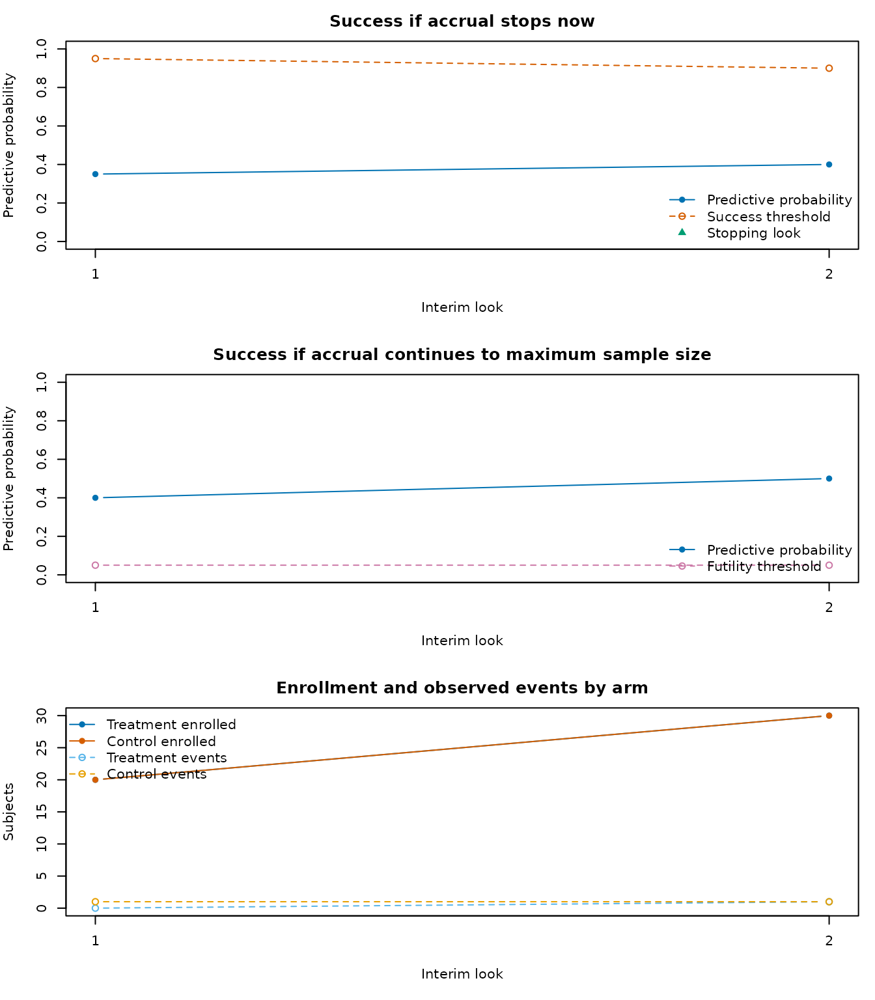

# Inspecting adaptive decision paths

``` r

library(goldilocks)
```

An adaptive trial is easier to assess when the final result can be
connected back to the interim decisions that led to it. By default,
[`survival_adapt()`](https://graemeleehickey.github.io/goldilocks/reference/survival_adapt.md)
returns its compact, one-row final summary. Set `return_trace = TRUE` to
request a `goldilocks_trial` object with that summary and a tidy row for
each interim look.

## A traced trial

This small Bayesian survival design has two interim looks. The treatment
arm is assumed to have a lower cumulative failure probability by 24
months.

``` r

end_of_study <- 24
hazard_control <- prop_to_haz(c(0.20, 0.35), 12, end_of_study)
hazard_treatment <- prop_to_haz(c(0.12, 0.24), 12, end_of_study)

trial <- survival_adapt(
  hazard_treatment = hazard_treatment,
  hazard_control = hazard_control,
  cutpoints = 12,
  N_total = 80,
  lambda = 8,
  lambda_time = NULL,
  interim_look = c(40, 60),
  end_of_study = end_of_study,
  prior = c(0.1, 0.1),
  block = 2,
  rand_ratio = c(1, 1),
  prop_loss = 0.05,
  alternative = "less",
  h0 = 0,
  Fn = c(0.05, 0.05),
  Sn = c(0.95, 0.90),
  prob_ha = 0.95,
  N_impute = 20,
  N_mcmc = 20,
  method = "bayes-surv",
  empty_interval = "prior",
  return_trace = TRUE
)

trial
#> Goldilocks adaptive trial
#>   prob_threshold margin alternative N_treatment N_control N_enrolled N_max
#> 1           0.95      0        less          40        40         80    80
#>   post_prob_ha   est_final ppp_success stop_futility stop_expected_success
#> 1          0.7 -0.06199122         0.4             0                     0
#> 
#> Interim looks completed: 2
```

The summary element is the familiar final analysis output. The trace
element is an audit trail of the interim path.

``` r

trial$summary
#>   prob_threshold margin alternative N_treatment N_control N_enrolled N_max
#> 1           0.95      0        less          40        40         80    80
#>   post_prob_ha   est_final ppp_success stop_futility stop_expected_success
#> 1          0.7 -0.06199122         0.4             0                     0
trial$trace
#>   look planned_N calendar_time N_enrolled N_treatment N_control
#> 1    1        40      4.238838         40          20        20
#> 2    2        60      6.628455         60          30        30
#>   events_treatment events_control N_pending N_not_enrolled ppp_stop_now
#> 1                0              1        39             40         0.35
#> 2                1              1        58             20         0.40
#>   success_threshold ppp_success_at_max futility_threshold decision
#> 1              0.95                0.4               0.05 continue
#> 2              0.90                0.5               0.05 continue
#>   warning_count warning_messages
#> 1             0                 
#> 2             0
summarise_trial_trace(trial)
#>   interim_looks_completed last_look last_decision final_N final_post_prob_ha
#> 1                       2         2      continue      80                0.7
#>   ppp_stop_now ppp_success_at_max warning_count
#> 1          0.4                0.5             0
```

For each completed look, `ppp_stop_now` is the predictive probability of
success if enrollment stops at that look. It is compared with
`success_threshold`. `ppp_success_at_max` is the predictive probability
of success if enrollment continues to the maximum sample size. It is
compared with `futility_threshold`. The decision column records whether
the design continued, stopped for expected success, or stopped for
futility.

The trace does not retain posterior draws or completed imputed data
sets. That keeps a traced trial small enough to inspect and share while
leaving the underlying random-number path unchanged.

## Visualizing the path

``` r

plot_trial_trace(trial)
```



The first two panels show the two predictive probabilities alongside
their decision thresholds. The final panel shows enrollment and observed
events by arm at each look. Warnings raised during a look, such as
empty-interval handling, are recorded in `warning_messages` and remain
visible as ordinary R warnings.

## Summarizing many simulated trials

Traces are intended for examining individual trial paths. By default,
[`sim_trials()`](https://graemeleehickey.github.io/goldilocks/reference/sim_trials.md)
keeps only its compact result data frame, which is more suitable for
large operating characteristic simulations. Set `return_trace = TRUE` to
retain the interim paths across simulations.
[`plot_sim_stopping()`](https://graemeleehickey.github.io/goldilocks/reference/plot_sim_stopping.md)
summarizes where and why enrollment stopped through marginal,
conditional, cumulative, or flowchart views, while
[`plot_sim_decisions()`](https://graemeleehickey.github.io/goldilocks/reference/plot_sim_decisions.md)
shows how the two predictive probabilities map to the decision regions
at each look. Supplying the complete traced result ensures that stopping
views include reached looks at which no trial stopped.

``` r

sims <- sim_trials(
  hazard_treatment = hazard_treatment,
  hazard_control = hazard_control,
  cutpoints = 12,
  N_total = 80,
  lambda = 8,
  lambda_time = NULL,
  interim_look = c(40, 60),
  end_of_study = end_of_study,
  prior = c(0.1, 0.1),
  block = 2,
  rand_ratio = c(1, 1),
  prop_loss = 0.05,
  alternative = "less",
  h0 = 0,
  Fn = c(0.05, 0.05),
  Sn = c(0.95, 0.90),
  prob_ha = 0.95,
  N_impute = 20,
  N_mcmc = 20,
  N_trials = 500,
  method = "bayes-surv",
  return_trace = TRUE,
  seed = 5702
)

summarise_sims(sims$sims)
plot_sim_stopping(sims)
plot_sim_stopping(sims, type = "flowchart")
plot_sim_decisions(sims)
```

The three simulation plotting functions answer different questions.
[`plot_sim_stopping()`](https://graemeleehickey.github.io/goldilocks/reference/plot_sim_stopping.md)
describes the terminal sample-size distribution and can re-express the
same stopping paths conditionally, cumulatively, or as a flow;
[`plot_sim_decisions()`](https://graemeleehickey.github.io/goldilocks/reference/plot_sim_decisions.md)
explains how interim predictive probabilities produced those decisions.
To compare operating characteristics across a grid of true treatment
effects, summarize the scenarios together and supply their numeric
effect values to
[`plot_sim_ocs()`](https://graemeleehickey.github.io/goldilocks/reference/plot_sim_ocs.md):

``` r

scenario_oc <- summarise_sims(list(
  "null" = sims_null$sims,
  "moderate" = sims_moderate$sims,
  "target" = sims$sims
))
scenario_oc$true_event_probability_difference <- c(0, -0.05, -0.10)

plot_sim_ocs(
  scenario_oc,
  effect = "true_event_probability_difference",
  xlab = "True treatment-control event-probability difference"
)
```

For reproducible simulations, set `seed` in
[`sim_trials()`](https://graemeleehickey.github.io/goldilocks/reference/sim_trials.md).
The per-trial random streams make the compact simulation results
reproducible across supported parallel backends. For a detailed
explanation of the decision algorithm and calibration, see the
“Technical details of the Goldilocks design” vignette.
