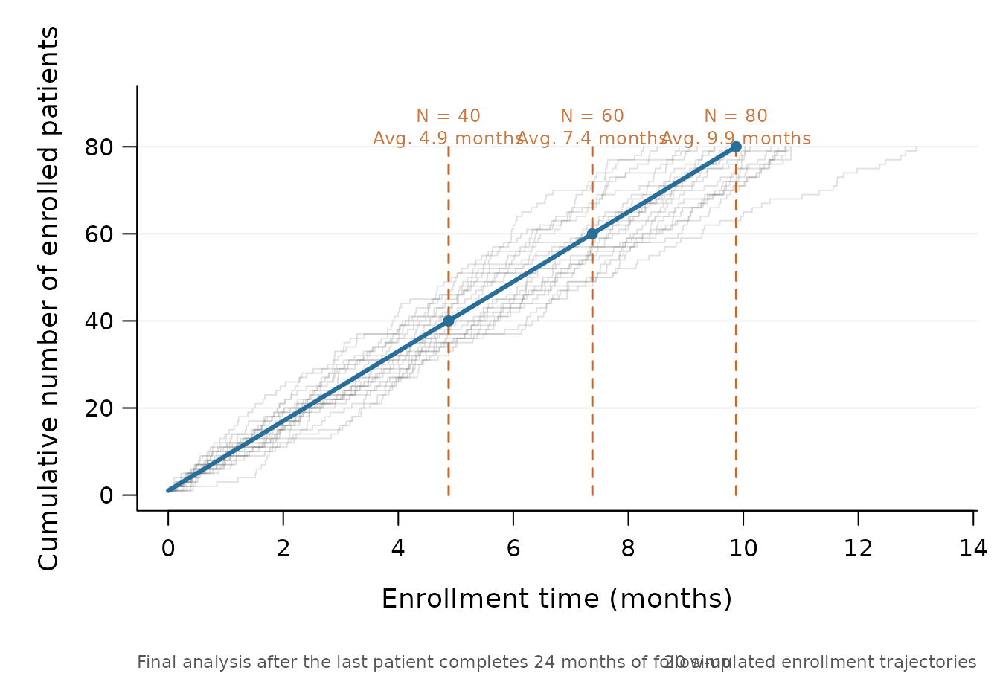
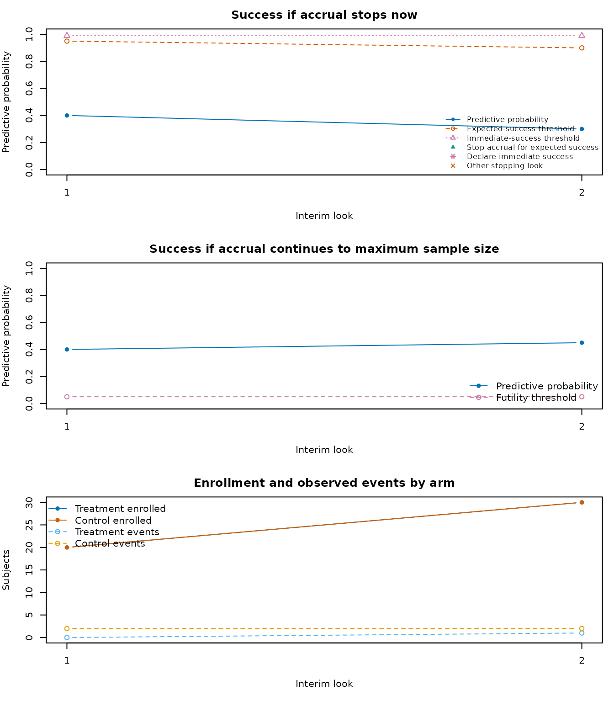

# Inspecting adaptive decision paths

``` r

library(goldilocks)
```

An adaptive trial is easier to assess when the final result can be
connected back to the interim decisions that led to it. By default,
[`survival_adapt()`](https://graemeleehickey.github.io/goldilocks/reference/survival_adapt.md)
returns a one-row trial summary. Set `return_trace = TRUE` to retain the
summary together with one record for each completed interim look.

## Reviewing one trial’s interim history

This small Bayesian survival design has two interim looks. The treatment
arm is assumed to have a lower cumulative failure probability by 24
months.

``` r

end_of_study <- 24
hazard_control <- prop_to_haz(c(0.20, 0.35), 12, end_of_study)
hazard_treatment <- prop_to_haz(c(0.12, 0.24), 12, end_of_study)

trial <- survival_adapt(
  hazard_treatment = hazard_treatment,
  hazard_control = hazard_control,
  cutpoints = 12,
  N_total = 80,
  lambda = 8,
  lambda_time = NULL,
  interim_look = c(40, 60),
  end_of_study = end_of_study,
  prior_surv = c(0.1, 0.1),
  block = 2,
  rand_ratio = c(control = 1, treatment = 1),
  prop_loss = 0.05,
  alternative = "less",
  h0 = 0,
  Fn = c(0.05, 0.05),
  Sn = c(0.95, 0.90),
  Qn = c(0.99, 0.99),
  prob_ha = 0.95,
  N_impute = 20,
  N_mcmc = 20,
  method = "bayes-surv",
  empty_interval = "prior",
  return_trace = TRUE
)

trial
#> Goldilocks adaptive trial
#>   prob_threshold margin alternative N_treatment N_control N_enrolled N_max
#> 1           0.95      0        less          40        40         80    80
#>   post_prob_ha   est_final ppp_success stop_futility stop_immediate_success
#> 1          0.8 -0.08108357        0.45             0                      0
#>   stop_expected_success trial_success     stopping_reason decision_time
#> 1                     0         FALSE maximum_sample_size      33.09515
#>   accrual_stop_time analysis_ready_time planned_completion_time
#> 1          9.095155            33.09515                33.09515
#>   followup_person_time peak_active_followup
#> 1             1643.469                   76
#> 
#> Interim looks completed: 2
```

The trial summary reports the official outcome and final analysis, when
one is required. The interim history provides an audit trail of the
predictive probabilities and decisions.

``` r

trial$summary
#>   prob_threshold margin alternative N_treatment N_control N_enrolled N_max
#> 1           0.95      0        less          40        40         80    80
#>   post_prob_ha   est_final ppp_success stop_futility stop_immediate_success
#> 1          0.8 -0.08108357        0.45             0                      0
#>   stop_expected_success trial_success     stopping_reason decision_time
#> 1                     0         FALSE maximum_sample_size      33.09515
#>   accrual_stop_time analysis_ready_time planned_completion_time
#> 1          9.095155            33.09515                33.09515
#>   followup_person_time peak_active_followup
#> 1             1643.469                   76
trial$trace
#>   look planned_N calendar_time active_followup N_enrolled N_treatment N_control
#> 1    1        40      4.238838              38         40          20        20
#> 2    2        60      6.628455              57         60          30        30
#>   events_treatment events_control N_pending N_not_enrolled ppp_stop_now
#> 1                0              2        38             40         0.60
#> 2                1              2        57             20         0.45
#>   ppp_stop_now_mcse ppp_stop_now_lower ppp_stop_now_upper ppp_stop_now_draws
#> 1         0.1095445          0.3935849          0.7829314                 20
#> 2         0.1112430          0.2586506          0.6530686                 20
#>   success_threshold immediate_success_threshold immediate_success_crossed
#> 1              0.95                        0.99                     FALSE
#> 2              0.90                        0.99                     FALSE
#>   expected_success_crossed ppp_success_at_max ppp_success_at_max_mcse
#> 1                    FALSE                0.6               0.1095445
#> 2                    FALSE                0.4               0.1095445
#>   ppp_success_at_max_lower ppp_success_at_max_upper ppp_success_at_max_draws
#> 1                0.3935849                0.7829314                       20
#> 2                0.2170686                0.6064151                       20
#>   futility_threshold futility_crossed inner_mc_uncertain_stop_now
#> 1               0.05            FALSE                          12
#> 2               0.05            FALSE                           9
#>   inner_mc_uncertain_success_at_max decision                 decision_reason
#> 1                                12 continue continue_thresholds_not_crossed
#> 2                                 8 continue continue_thresholds_not_crossed
#>   empty_interval_fallback_count
#> 1                             2
#> 2                             2
#>                                          empty_interval_fallbacks warning_count
#> 1 prior: treatment=0, interval=2 | prior: treatment=1, interval=2             0
#> 2 prior: treatment=0, interval=2 | prior: treatment=1, interval=2             0
#>   warning_messages
#> 1                 
#> 2
summarise_trial_trace(trial)
#>   interim_looks_completed last_look last_decision final_N final_post_prob_ha
#> 1                       2         2      continue      80                0.8
#>   ppp_stop_now ppp_success_at_max warning_count trial_success
#> 1         0.45                0.4             0         FALSE
```

For each completed look, `ppp_stop_now` is the predictive probability of
success if enrollment stops at that look. It is compared first with
`immediate_success_threshold` and then with `success_threshold`.
`ppp_success_at_max` is the predictive probability of success if
enrollment continues to the maximum sample size and is compared with
`futility_threshold`. The `decision` column records whether the design
declared immediate success, stopped accrual for expected success,
stopped for binding futility, or continued.

The interim history retains Monte Carlo summaries rather than every
posterior draw or completed imputation. It is therefore concise enough
to include in a simulation review or interim-analysis record.

## Visualizing the enrollment plan

Trial and simulation results retain their evaluated enrollment design,
so the enrollment projection can be drawn without repeating `lambda`,
`N_total`, or the interim looks:

``` r

plot_enrollment(
  trial,
  n_sim = 20,
  seed = 20260727,
  time_unit = "months"
)
```



The blue line is expected cumulative enrollment and the grey step
functions are newly simulated enrollment trajectories. Dashed guides
mark the two interim looks and the maximum sample size. Because this
design has a constant enrollment rate, each displayed milestone time is
its mean arrival time, (N - 1) / \lambda. For piecewise enrollment
rates, the plot instead labels the time at which expected cumulative
enrollment reaches the milestone. Supplying `seed` makes the displayed
enrollment trajectories reproducible.

## Plotting the interim decision path

``` r

plot_trial_trace(trial)
```



The first two panels show the two predictive probabilities alongside
their decision thresholds. The final panel shows enrollment and observed
events by arm at each look. Warnings raised during a look, such as
empty-interval handling, are recorded in `warning_messages` and remain
visible as ordinary R warnings.

## Summarizing many simulated trials

Interim histories are intended for examining individual trial paths. By
default,
[`sim_trials()`](https://graemeleehickey.github.io/goldilocks/reference/sim_trials.md)
retains the trial-level outcomes needed to estimate operating
characteristics. Set `return_trace = TRUE` to retain the interim paths
as well.
[`plot_sim_stopping()`](https://graemeleehickey.github.io/goldilocks/reference/plot_sim_stopping.md)
summarizes where and why enrollment stopped through marginal,
conditional, cumulative, or flowchart views, while
[`plot_sim_decisions()`](https://graemeleehickey.github.io/goldilocks/reference/plot_sim_decisions.md)
shows how the two predictive probabilities map to the decision regions
at each look. Supplying the complete traced result ensures that stopping
views include reached looks at which no trial stopped.

``` r

sims <- sim_trials(
  hazard_treatment = hazard_treatment,
  hazard_control = hazard_control,
  cutpoints = 12,
  N_total = 80,
  lambda = 8,
  lambda_time = NULL,
  interim_look = c(40, 60),
  end_of_study = end_of_study,
  prior_surv = c(0.1, 0.1),
  block = 2,
  rand_ratio = c(control = 1, treatment = 1),
  prop_loss = 0.05,
  alternative = "less",
  h0 = 0,
  Fn = c(0.05, 0.05),
  Sn = c(0.95, 0.90),
  Qn = c(0.99, 0.99),
  prob_ha = 0.95,
  N_impute = 20,
  N_mcmc = 20,
  N_trials = 500,
  method = "bayes-surv",
  return_trace = TRUE,
  seed = 5702
)

summarise_sims(sims)
plot_sim_stopping(sims)
plot_sim_stopping(sims, type = "flowchart")
plot_sim_decisions(sims)
```

The three simulation plotting functions answer different questions.
[`plot_sim_stopping()`](https://graemeleehickey.github.io/goldilocks/reference/plot_sim_stopping.md)
describes the terminal sample-size distribution and can re-express the
same stopping paths conditionally, cumulatively, or as a flow;
[`plot_sim_decisions()`](https://graemeleehickey.github.io/goldilocks/reference/plot_sim_decisions.md)
explains how interim predictive probabilities produced those decisions.
To compare operating characteristics across a grid of true treatment
effects, summarize the scenarios together and supply their numeric
effect values to
[`plot_sim_ocs()`](https://graemeleehickey.github.io/goldilocks/reference/plot_sim_ocs.md):

``` r

scenario_oc <- summarise_sims(list(
  "null" = sims_null,
  "moderate" = sims_moderate,
  "target" = sims
))
scenario_oc$true_event_probability_difference <- c(0, -0.05, -0.10)

plot_sim_ocs(
  scenario_oc,
  effect = "true_event_probability_difference",
  xlab = "True treatment-control event-probability difference"
)
```

For reproducible simulations, prespecify `seed` in
[`sim_trials()`](https://graemeleehickey.github.io/goldilocks/reference/sim_trials.md).
Results are then reproducible whether the trials are evaluated
sequentially or in parallel. For a detailed explanation of the decision
algorithm and calibration, see the “Technical details of the Goldilocks
design” vignette.
