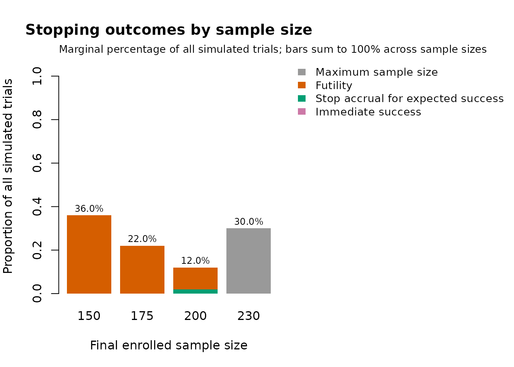
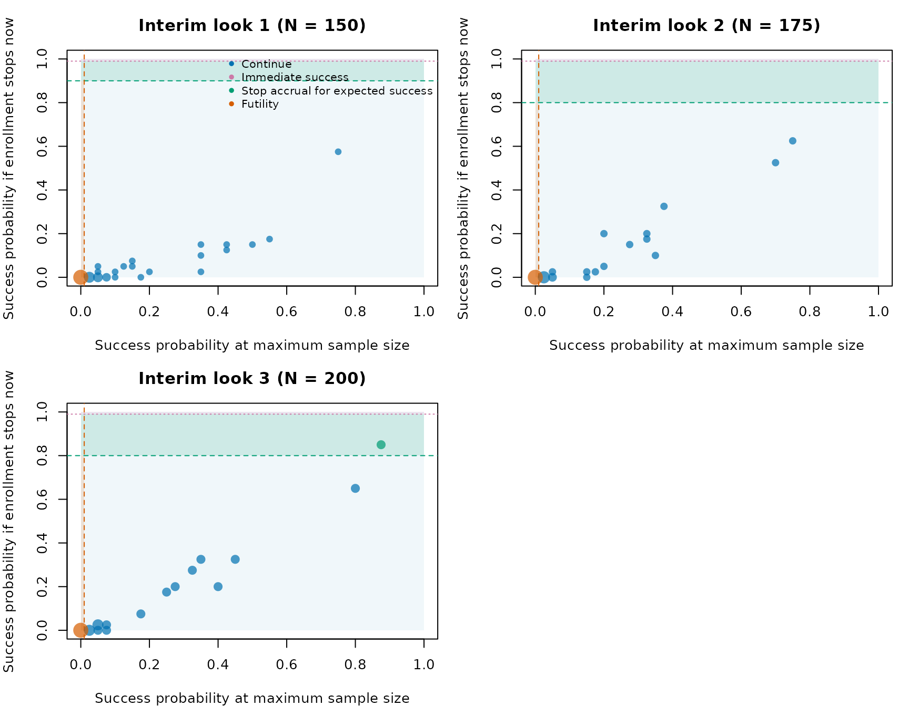

# ThermoCool AF: immediate success from predictive probability

``` r

library(goldilocks)
```

The ThermoCool AF trial is a useful published example of a Bayesian
design that used the same predictive probability to distinguish between
stopping accrual and declaring immediate trial success. The trial
compared radiofrequency catheter ablation with antiarrhythmic drug
therapy (ADT) in patients with symptomatic paroxysmal atrial
fibrillation. It was registered as
[NCT00116428](https://clinicaltrials.gov/study/NCT00116428), reported by
[Wilber et
al. (2010)](https://jamanetwork.com/journals/jama/fullarticle/185277),
and supported FDA premarket approval supplement
[P030031/S011](https://www.accessdata.fda.gov/scripts/cdrh/cfdocs/cfpma/pma.cfm?id=P030031S011).

This vignette uses the trial to explain `Qn`, the upper boundary for
immediate success in `goldilocks`. It is a **ThermoCool-inspired package
example, not an exact reconstruction or regulatory validation**. The
public sources disclose the principal decision boundaries and
longitudinal imputation model, but some simulation inputs are
unavailable. In addition, the package rule deliberately differs from the
trial protocol in its futility statistic, comparison operators, and
treatment of a separate information gate for an early claim.

## Trial and endpoint

ThermoCool AF was a prospective, multicenter, randomized, unblinded
trial. Patients were allocated within site in blocks of 11: seven to
catheter ablation and four to ADT. The primary effectiveness endpoint
was freedom from protocol-defined treatment failure during comparable
nine-month evaluation periods. Treatment failure included documented
symptomatic paroxysmal atrial fibrillation; the protocol also classified
specified procedural, medication, and intolerance outcomes as failures.

The planned maximum sample size was 230. Decision-capable interim
analyses were planned after 150, 175, and 200 accrued patients. Trial
success was defined by

\Pr(p_T \> p_C \mid \mathcal D) \ge 0.98,

where p_T and p_C are the nine-month chronic-success probabilities in
the ablation and ADT groups. The final posterior criterion was selected
through simulation to control the one-sided type I error at no more than
0.025.

The trial began with a fixed-sample frequentist design and was amended
while accrual was underway. FDA’s advisory briefing reports that the 106
patients already accrued were treated as a non-stopping look in the
operating-characteristic simulations, with a statistical penalty. This
historical feature is important to the reported calibration, but it is
not an actionable `interim_look` in the package example below.

## The reported stopping rules

At a planned interim analysis, the trial calculated the predictive
probability that the final posterior criterion would be met after
currently enrolled patients completed follow-up. In package notation
this is P\_{n,\ell}. The reported rules were:

- If P\_{n,\ell} \ge 0.99, stop and make an early claim of success.
- Otherwise, stop accrual for expected success if P\_{n,\ell} \ge 0.90
  at n=150, or P\_{n,\ell} \ge 0.80 at n=175 or 200, and continue
  follow-up.
- Stop for futility if **both** P\_{n,\ell}\<0.01 and
  P\_{n\_{\max},\ell}\<0.01.
- Otherwise, continue accrual.

The JAMA methods summarize the 0.99 rule as an immediate claim at an
interim analysis. The FDA advisory materials provide an operational
detail: after accrual stopped, the early-claim analysis was performed
once either 4.5 months had elapsed or at least 50% of enrolled patients
had complete effectiveness outcomes, whichever came first. The public
record reports that this information condition was satisfied when the
first analysis was performed.

In practice, the first planned 150-patient analysis occurred after 160
patients had been enrolled because of operational timing; 148 were in
the effectiveness analysis. The predictive probability was greater than
0.999, 50% of enrollees had an effectiveness determination, and the
trial declared early success. Seven more patients were enrolled before
shutdown was completed, producing 167 randomized patients in the updated
report.

## The four-way `goldilocks` rule

The package enhancement keeps predictive probability as the key interim
statistic but uses the following ordered rule:

d\_\ell = \begin{cases} \text{immediate success}, & P\_{n,\ell} \>
Q\_\ell, \\ \text{stop accrual for expected success}, & S\_\ell \<
P\_{n,\ell} \le Q\_\ell, \\ \text{binding futility}, &
P\_{n\_{\max},\ell} \< F\_\ell, \\ \text{continue}, & \text{otherwise.}
\end{cases}

Decision order matters. An immediate-success crossing is terminal even
if a futility boundary also appears crossed. Equality with `Qn` does not
declare immediate success, and equality with `Sn` does not stop accrual
for expected success. `Qn = 1` disables immediate-success stopping at a
look because a predictive probability cannot be strictly greater than
one. The package requires `Sn <= Qn` at every look; setting them equal
removes the expected-success interval at that look.

For the ThermoCool-inspired mapping, the threshold vectors are:

``` r

N_total <- 230
interim_look <- c(150, 175, 200)

Qn <- rep(0.99, length(interim_look))
Sn <- c(0.90, 0.80, 0.80)
Fn <- rep(0.01, length(interim_look))
```

These values reproduce the reported numerical boundaries, but not every
protocol detail. The package uses strict upper-boundary comparisons,
whereas the publications describe “at least” 0.99, 0.90, or 0.80. More
importantly, the package’s requested futility rule uses only
P\_{n\_{\max},\ell}\<F\_\ell; ThermoCool AF required both predictive
probabilities below 0.01. The package also evaluates `Qn` at each
scheduled look without a separate 4.5-month/50% information gate.

## Source and status of modeled inputs

The labels in the following table are used consistently throughout the
vignette:

- **reported**: stated numerically in a public primary source;
- **inferred**: calculated from, or used to encode, reported
  information;
- **assumed**: selected for this runnable package example;
- **unavailable**: needed for exact reconstruction but not publicly
  supplied or not representable in the current package interface.

| Input | Value | Status | Source and mapping |
|:---|:---|:---|:---|
| `N_total` | 230 | reported | JAMA Statistical Methods and FDA advisory briefing |
| `interim_look` | 150, 175, 200 | reported | JAMA Statistical Methods and FDA advisory briefing |
| `Qn` | 0.99 at each look | reported | Reported early-claim boundary; package applies its strict \> rule |
| `Sn` | 0.90, 0.80, 0.80 | reported | Reported expected-success accrual boundaries |
| `Fn` | 0.01 at each look | reported | Reported numeric futility boundary |
| Futility statistic | Package uses P\[nmax,l\] only | assumed | The requested enhancement differs from ThermoCool’s P\[n,l\] and P\[nmax,l\] rule |
| Early-claim information gate | Not represented | reported | FDA briefing and transcript report 4.5 months or 50% endpoint-complete |
| Non-stopping 106-patient look | Not represented as an actionable look | reported | FDA requested it after the mid-trial amendment; zero probability of stopping |
| `prob_ha` | 0.98 | reported | Historical success was at least 0.98; the package classifies success using its strict \> comparison |
| `method`, `alternative`, `h0` | bayes-bin, less, 0 | inferred | Failure is the modeled binary event, so benefit is a lower treatment failure probability |
| `prior_bin` | Beta(1, 1) in both arms | reported | FDA advisory transcript and sponsor briefing |
| `cutpoints`, `end_of_study` | 0.5 and 2 months; 9-month horizon | reported | JAMA and FDA describe breaks at 2 weeks/0.5 months and 2 months |
| Sponsor predictive hazard prior | Three arm-specific piecewise rates with a hierarchical prior | reported | FDA briefing discloses Exp(rate = 1) priors on the Gamma hyperparameters, but not a directly reproducible fixed package prior |
| `prior_surv`, `prior_surv_final` | Fixed Gamma(1, 1) approximation in each interval and arm | assumed | Assumed plug-in approximation that sets both Gamma hyperparameters to the mean, 1, of their disclosed Exp(rate = 1) hyperpriors; not the sponsor’s hierarchical prior |
| `block`, `rand_ratio` | 11; control 4 : treatment 7 | reported | JAMA Study Design |
| `lambda`, `lambda_time` | 0.83, 3.50, 8.92 patients/month; changes at months 12 and 24 | inferred | Derived from FDA’s 11 patients after year 1, 53 after year 2, and 160 near year 3; not a protocol accrual generator |
| Data-generating hazards | June 2008 failures divided by exposure within each interval | inferred | Derived from the FDA SSED Table 8; descriptive observed-data scenario, not a planning assumption |
| Sponsor planning scenarios | Not publicly available in sufficient detail | unavailable | Public materials state that operating characteristics were simulated but redact or omit enough inputs to prevent exact reproduction |
| `prop_loss` | 0.05 in each arm | assumed | Runtime example; the package’s random censoring is not equivalent to the eight randomized patients who did not receive assigned treatment |
| `imputed_final` | TRUE | inferred | JAMA reports multiple imputation for incomplete outcomes; package implementation is an approximation |
| `N_impute` | 100 for one trial; 40 for small OC simulations | assumed | Runtime choices; the sponsor’s predictive draw count is unavailable |
| Evaluated `N_trials` | 50 per scenario | assumed | Runtime choice; the sponsor briefing reports 10,000 simulated trials per scenario |

## Mapping the longitudinal model

The completed endpoint is binary, but its status is learned over time.
The trial predicted unknown nine-month outcomes with an arm-specific
piecewise-exponential time-to-failure model. The three intervals were
0–0.5 months, 0.5–2 months, and 2–9 months. After imputation, a
patient’s failure time was reduced to a binary chronic-failure
indicator, and the completed-data analysis compared arm-specific success
probabilities.

`goldilocks` represents this structure with `method = "bayes-bin"` and
`binary_imputation = "event-time"`. The package is parameterized on
event probability, so the code models chronic **failure** rather than
chronic success:

p\_{\text{failure}} = 1 - p\_{\text{chronic success}}.

Consequently, superiority of ablation is encoded as

\Pr(p\_{T,\text{failure}} - p\_{C,\text{failure}} \< 0 \mid \mathcal D)
\> 0.98,

using `alternative = "less"` and `h0 = 0`. Independent uniform priors on
the published chronic-success probabilities become the same independent
`Beta(1, 1)` priors after complementing to failure probabilities.

``` r

analysis_cutpoints_month <- c(0.5, 2)
effectiveness_horizon_month <- 9

prior_bin <- c(1, 1)

# Assumed plug-in approximation using the means of the disclosed Exp(1)
# hyperpriors; this is not the sponsor's hierarchical hazard prior.
prior_surv <- c(shape = 1, rate = 1)
```

The FDA summary reports observed exposure and failure counts for the
same three intervals in its June 2008 analysis. Dividing failures by
exposure produces a fully documented descriptive generator:

``` r

fda_interval_data <- data.frame(
  arm = rep(c("treatment", "control"), each = 3),
  interval = rep(c("0--0.5", "0.5--2", "2--9"), 2),
  exposure_months = c(40.21, 104.17, 413.09, 23.27, 54.21, 90.46),
  failures = c(26, 3, 7, 13, 14, 20)
)
fda_interval_data$hazard_per_month <- with(
  fda_interval_data,
  failures / exposure_months
)

knitr::kable(fda_interval_data, digits = 4)
```

| arm       | interval | exposure_months | failures | hazard_per_month |
|:----------|:---------|----------------:|---------:|-----------------:|
| treatment | 0–0.5    |           40.21 |       26 |           0.6466 |
| treatment | 0.5–2    |          104.17 |        3 |           0.0288 |
| treatment | 2–9      |          413.09 |        7 |           0.0169 |
| control   | 0–0.5    |           23.27 |       13 |           0.5587 |
| control   | 0.5–2    |           54.21 |       14 |           0.2583 |
| control   | 2–9      |           90.46 |       20 |           0.2211 |

``` r


hazard_treatment <- subset(
  fda_interval_data,
  arm == "treatment"
)$hazard_per_month
hazard_control <- subset(
  fda_interval_data,
  arm == "control"
)$hazard_per_month
```

These are post-trial empirical rates, not prospective design
assumptions. They also approximate failures assigned at the start of the
evaluation window with a continuous hazard. They are used only to create
a strong-benefit scenario that resembles the information pattern in the
public record.

The event-free probabilities implied directly by these rates are:

``` r

interval_length_month <- diff(c(
  0,
  analysis_cutpoints_month,
  effectiveness_horizon_month
))

implied_chronic_success <- data.frame(
  Arm = c("Catheter ablation", "ADT control"),
  `Implied nine-month chronic-success probability` = c(
    exp(-sum(hazard_treatment * interval_length_month)),
    exp(-sum(hazard_control * interval_length_month))
  ),
  check.names = FALSE
)

knitr::kable(implied_chronic_success, digits = 3)
```

| Arm               | Implied nine-month chronic-success probability |
|:------------------|-----------------------------------------------:|
| Catheter ablation |                                          0.616 |
| ADT control       |                                          0.109 |

The JAMA paper reports Kaplan-Meier chronic-success estimates of 0.66
and 0.16. The values above need not equal those estimates: they are
obtained by inserting raw interval rates into a piecewise-exponential
distribution, without the sponsor’s full posterior calculation, protocol
handling of time-zero failures, or analysis-population rules.

## An observed-history accrual approximation

Accrual speed determines how much nine-month endpoint information is
available at an enrollment-triggered look. FDA reports 11 accrued
patients after one year, 53 after two years, and 160 near the third
year. The following piecewise rates preserve those increments
approximately:

``` r

enrollment_rate_per_month <- c(
  year_1 = (11 - 1) / 12,
  year_2 = (53 - 11) / 12,
  year_3 = (160 - 53) / 12
)
enrollment_rate_change_month <- c(12, 24)

data.frame(
  `Trial-calendar interval` = c("0--12 months", "12--24 months", "24+ months"),
  `Patients per month` = enrollment_rate_per_month,
  check.names = FALSE
)
#>        Trial-calendar interval Patients per month
#> year_1            0--12 months          0.8333333
#> year_2           12--24 months          3.5000000
#> year_3              24+ months          8.9166667
```

This is an inferred operational approximation, not a reported Poisson
accrual model. `goldilocks` fixes the first enrollment at trial-calendar
time zero, so the first rate generates 10 additional expected arrivals
by month 12, for 11 patients in total. The later rates use the reported
cumulative increments. The schedule intentionally captures the slow
start and later acceleration because a single average rate would give a
different amount of follow-up at the first look.

## One simulated trial

The following call simulates one trial under the descriptive FDA-rate
scenario. It uses only 100 predictive imputations so the vignette
remains quick to build. That is too few for regulatory calibration of
boundaries as extreme as 0.99 and 0.01.

``` r

set.seed(1030236)

thermocool_trial <- survival_adapt(
  hazard_treatment = hazard_treatment,
  hazard_control = hazard_control,
  cutpoints = analysis_cutpoints_month,
  N_total = N_total,
  lambda = enrollment_rate_per_month,
  lambda_time = enrollment_rate_change_month,
  interim_look = interim_look,
  end_of_study = effectiveness_horizon_month,
  prior_surv = prior_surv,
  prior_surv_final = prior_surv,
  prior_bin = prior_bin,
  bin_method = "quadrature",
  binary_imputation = "event-time",
  block = 11,
  rand_ratio = c(control = 4, treatment = 7),
  prop_loss = 0.05,
  alternative = "less",
  h0 = 0,
  Fn = Fn,
  Sn = Sn,
  Qn = Qn,
  prob_ha = 0.98,
  N_impute = 100,
  empty_interval = "prior",
  method = "bayes-bin",
  imputed_final = TRUE,
  return_trace = TRUE
)

knitr::kable(
  thermocool_trial$summary[, c(
    "N_enrolled",
    "ppp_success",
    "stop_immediate_success",
    "stop_expected_success",
    "stop_futility",
    "trial_success",
    "stopping_reason",
    "decision_time"
  )],
  digits = 3
)
```

| N_enrolled | ppp_success | stop_immediate_success | stop_expected_success | stop_futility | trial_success | stopping_reason | decision_time |
|---:|---:|---:|---:|---:|:---|:---|---:|
| 150 | 1 | 1 | 0 | 0 | TRUE | immediate_success | 34.744 |

`stop_immediate_success` is an official terminal success decision. It
does not wait for a later completed-follow-up analysis, so
`post_prob_ha` and the final effect estimate are `NA`. Binding futility
is likewise an official terminal failure. For compatibility, the package
still attempts its historical completed-follow-up diagnostic after
futility; if that diagnostic cannot be computed, its two fields are `NA`
and `trial_success` remains `FALSE`.

The trace makes the ordered rule auditable:

``` r

knitr::kable(
  thermocool_trial$trace[, c(
    "look",
    "planned_N",
    "ppp_stop_now",
    "immediate_success_threshold",
    "success_threshold",
    "ppp_success_at_max",
    "futility_threshold",
    "decision"
  )],
  digits = 3
)
```

| look | planned_N | ppp_stop_now | immediate_success_threshold | success_threshold | ppp_success_at_max | futility_threshold | decision |
|---:|---:|---:|---:|---:|---:|---:|:---|
| 1 | 150 | 1 | 0.99 | 0.9 | 1 | 0.01 | stop_immediate_success |

Only looks actually reached appear in the trace. An immediate-success
decision prevents all subsequent looks.

## Small operating-characteristic demonstration

For simulation, collect common inputs in a named list and vary only the
data-generating hazards. The first scenario uses the FDA-derived
descriptive rates. The second assigns the control rates to both arms and
is therefore a simple no-treatment-effect scenario.

``` r

thermocool_design <- list(
  cutpoints = analysis_cutpoints_month,
  N_total = N_total,
  lambda = enrollment_rate_per_month,
  lambda_time = enrollment_rate_change_month,
  interim_look = interim_look,
  end_of_study = effectiveness_horizon_month,
  prior_surv = prior_surv,
  prior_surv_final = prior_surv,
  prior_bin = prior_bin,
  bin_method = "quadrature",
  binary_imputation = "event-time",
  block = 11,
  rand_ratio = c(control = 4, treatment = 7),
  prop_loss = 0.05,
  alternative = "less",
  h0 = 0,
  Fn = Fn,
  Sn = Sn,
  Qn = Qn,
  prob_ha = 0.98,
  N_impute = 40,
  empty_interval = "prior",
  method = "bayes-bin",
  imputed_final = TRUE,
  N_trials = 50,
  ncores = 2,
  return_trace = TRUE
)

thermocool_descriptive <- do.call(sim_trials, c(
  thermocool_design,
  list(
    hazard_treatment = hazard_treatment,
    hazard_control = hazard_control,
    seed = 1030236
  )
))

thermocool_null <- do.call(sim_trials, c(
  thermocool_design,
  list(
    hazard_treatment = hazard_control,
    hazard_control = hazard_control,
    seed = 1030237
  )
))

oc_small <- summarise_sims(list(
  "FDA-rate illustration" = thermocool_descriptive,
  "Equal-arm null" = thermocool_null
))

oc_display <- oc_small[, c(
  "scenario",
  "n_analyzed",
  "power",
  "stop_immediate_success",
  "stop_success",
  "stop_futility",
  "stop_max_N",
  "mean_N"
)]
names(oc_display)[names(oc_display) == "stop_success"] <-
  "stop_expected_success"

knitr::kable(oc_display, digits = 3)
```

| scenario | n_analyzed | power | stop_immediate_success | stop_expected_success | stop_futility | stop_max_N | mean_N |
|:---|---:|---:|---:|---:|---:|---:|---:|
| Equal-arm null | 50 | 0.02 | 0 | 0.02 | 0.68 | 0.3 | 185.5 |
| FDA-rate illustration | 50 | 1.00 | 1 | 0.00 | 0.00 | 0.0 | 150.0 |

With only 50 trials and 40 imputations per look, these estimates have
substantial Monte Carlo error. They demonstrate the workflow and the
mutually exclusive stopping categories; they do not estimate the trial’s
reported operating characteristics.
[`summarise_sims()`](https://graemeleehickey.github.io/goldilocks/reference/summarise_sims.md)
retains the historical name `stop_success` for stopping accrual for
expected success and reports immediate success separately as
`stop_immediate_success`.

The no-effect scenario provides a more informative view of the four
decision regions than the deliberately strong FDA-rate scenario:

``` r

plot_sim_stopping(thermocool_null)
```



``` r

plot_sim_decisions(thermocool_null)
```



In a decision plot, `Qn` adds a second horizontal boundary above `Sn`.
Observations above `Qn` are immediate successes. Observations between
`Sn` and `Qn` stop accrual for expected success. At or below `Sn`, `Fn`
separates binding futility from continued accrual.

## Design validation template

A design that permits immediate declaration of success must be
calibrated as a whole. Neither `Qn = 0.99` nor `prob_ha = 0.98`
automatically controls type I error in a new design. Calibration must
reflect all looks, the final analysis, the binding futility rule,
accrual, incomplete follow-up, the predictive model, and Monte Carlo
error.

The following unevaluated template increases both the number of
simulated trials and the predictive-imputation count. The latter value
is an analyst choice, not a reported ThermoCool setting.

``` r

thermocool_full_design <- modifyList(thermocool_design, list(
  N_trials = 10000,
  N_impute = 5000,
  ncores = 8,
  return_trace = FALSE
))

q_grid <- c(0.975, 0.99, 0.995, 1.00)

full_null <- lapply(seq_along(q_grid), function(i) {
  do.call(sim_trials, c(
    modifyList(thermocool_full_design, list(Qn = q_grid[i])),
    list(
      hazard_treatment = hazard_control,
      hazard_control = hazard_control,
      seed = 1031000 + i
    )
  ))
})
names(full_null) <- paste0("null: Qn = ", q_grid)

full_benefit <- lapply(seq_along(q_grid), function(i) {
  do.call(sim_trials, c(
    modifyList(thermocool_full_design, list(Qn = q_grid[i])),
    list(
      hazard_treatment = hazard_treatment,
      hazard_control = hazard_control,
      seed = 1032000 + i
    )
  ))
})
names(full_benefit) <- paste0("benefit: Qn = ", q_grid)

full_oc <- summarise_sims(c(full_null, full_benefit))
full_oc[, c(
  "scenario",
  "n_analyzed",
  "power",
  "power_mcse",
  "stop_immediate_success",
  "stop_immediate_success_mcse",
  "stop_success",
  "stop_futility",
  "stop_max_N",
  "mean_N",
  "mean_N_mcse"
)]
```

Useful additional scenarios include weaker treatment effects, different
control event rates, slower and faster accrual, arm-specific
missingness, alternative piecewise hazards, and violations of the
predictive model. The null design should be evaluated over a suitable
nuisance-parameter range rather than at a single equal-arm profile.
Because a 0.99 boundary is estimated from imputations, the predictive
draw count should also be chosen so that decisions near `Qn`, `Sn`, and
`Fn` are sufficiently stable.

## What this example does and does not reproduce

The example preserves the central statistical idea:

- one current-sample predictive probability drives two distinct upper
  decisions;
- `Qn` declares success immediately, whereas `Sn` only stops accrual;
- `Fn` acts on predictive success at the maximum sample size; and
- all thresholds are evaluated in a prespecified order.

It does not reproduce the sponsor’s source code, hierarchical hazard
prior, simulation scenarios, treatment-specific evaluation-window
origins, site-stratified randomization sequences, protocol deviations,
crossover, analysis-population exclusions, operational overrun, or the
original two-predictive-probability futility requirement. It also does
not recreate the mid-trial design amendment or its statistical penalty.
Those distinctions are why the simulated numerical results should not be
compared directly with the trial’s regulatory analysis.

## Primary sources

- Wilber DJ, Pappone C, Neuzil P, et al. [Comparison of antiarrhythmic
  drug therapy and radiofrequency catheter ablation in patients with
  paroxysmal atrial fibrillation: a randomized controlled
  trial](https://jamanetwork.com/journals/jama/fullarticle/185277).
  *JAMA*. 2010;303(4):333-340. <doi:10.1001/jama.2009.2029>.
- U.S. Food and Drug Administration. [Summary of Safety and
  Effectiveness Data, PMA
  P030031/S011](https://www.accessdata.fda.gov/cdrh_docs/pdf3/P030031S011B.pdf).
  The summary reports the approval analysis, longitudinal-model
  intervals, interval exposure and failures, and updated Bayesian
  results.
- U.S. Food and Drug Administration. [Circulatory System Devices Panel,
  November 20, 2008 meeting
  materials](https://www.accessdata.fda.gov/scripts/cdrh/cfdocs/cfAdvisory/details.cfm?mtg=705).
  The archive links the FDA and sponsor briefing information, slides,
  panel questions, and transcript used for the design-history and
  early-claim details above.
- U.S. Food and Drug Administration. [PMA supplement P030031/S011
  approval
  record](https://www.accessdata.fda.gov/scripts/cdrh/cfdocs/cfpma/pma.cfm?id=P030031S011).
  FDA issued the decision on February 6, 2009 for the expanded
  paroxysmal atrial-fibrillation indication.
