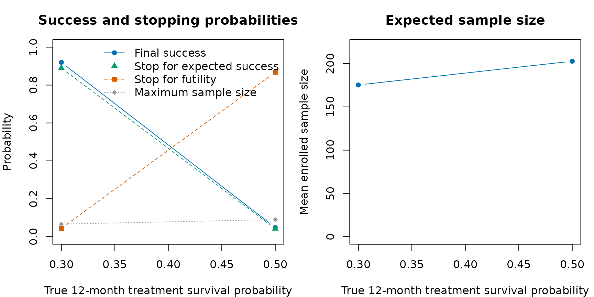
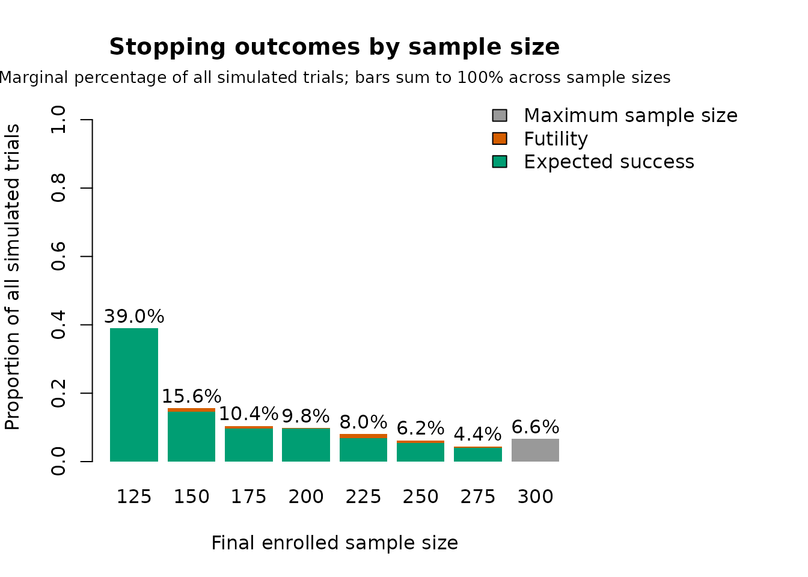
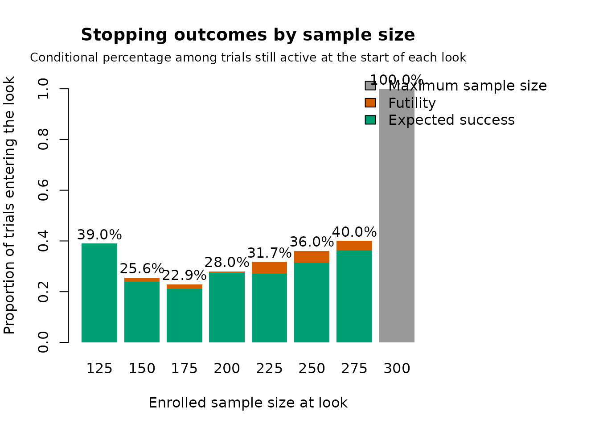
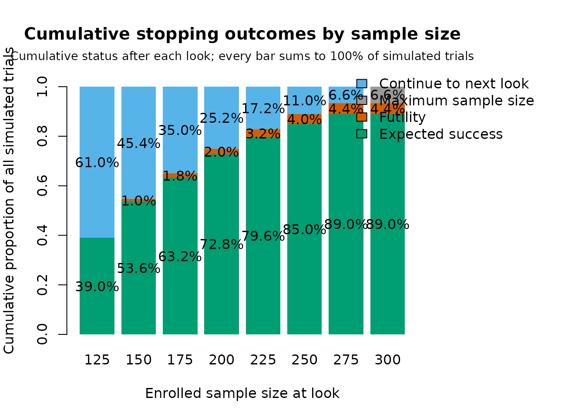

# Two-arm randomized trials

Broglio et al. (2014) presented an example from a hypothetical trial. We
will use a similar setup for this example, and break up the pieces to
make clear the argument choices for the package.

The setting is a two-arm randomized trial where patients are equally
randomized to either a control or a treatment arm. The primary endpoint
is overall survival (OS) measured from enrollment to death from any
cause or last follow-up. In `goldilocks`, enrollment time and
randomization time are treated as the same time point; in practice they
can differ, but that distinction is superfluous and therefore not
represented in the package simulator. The expected OS rate at 12-months
for the control arm is 30%. The minimum sample size is 100 and the
maximum sample size is 300. For simplicity, it is assumed that there is
no attrition. The maximum follow-up period for each subject is
12-months. This differs from the time-to-event example in Broglio et
al. (2014), which scheduled the primary analysis after accrual was
complete and all subjects had then completed 12 months of follow-up.
Thus, if accrual is stopped early for predicted success or the trial
continues accrual to the maximum sample size of 300 patients, the
primary analysis of OS will be conducted after each subject has
completed 12-months of follow-up.

From this information, we have:

- Equal randomization: `block = 2` and `rand_ratio = c(1, 1)` (default
  parameters)
- Primary endpoint is at 12-months: `end_of_study = 12`
- 12-month event rate for control arm:
  `hazard_control = prop_to_haz(1 - 0.30, endtime = 12)` (note that the
  input argument is the failure proportion, not the survival proportion)
- No change points in hazard: `cutpoints = 0` (default parameter)
- Maximum sample size: `N_total = 300`
- No attrition: `prop_loss = 0`

Sample size selection analyses are planned starting when 100 patients
are enrolled and after every additional 25 patients are enrolled. Early
stopping for futility is allowed starting with the 100 patient sample
size selection analysis and $`F_n`$ is 10%. Stopping accrual early for
predicted success is only allowed starting with the 200 patient sample
size selection analysis and $`S_n`$ is 90%. It is expected that an
average of 5 patients per month will be enrolled, with no change in
speed for the duration of the trial.

From this information, we have:

- Interim sample size looks: `interim_look = seq(100, 275, 25)`
- Futility probability thresholds: `Fn = rep(0.10, 8)`
- Predicted success probability thresholds: `Sn = c(1, rep(0.9, 7))`
- `lambda = 5` and `lambda_time = NULL` (default parameter)

Note that the first value of `Sn` is 1. This is because the trial is not
allowed to stop for predicted success at the first interim analysis of
$`n = 100`$. The remaining elements of `Sn` are 0.9, corresponding to
90%.

The primary analysis is a two-sided log-rank test, with success declared
at the $`\alpha = 0.05`$ level.

From this information, we have:

- Two-sided log-rank test used: `alternative = "two.sided"` and
  `method = "logrank"`
- $`\alpha = 0.05`$ level used to declare success: `prob_ha = 0.95`

Note that `prob_ha` is set as $`1 - 0.05`$. This allows us to
interchange between tests, including Bayesian tests
(`method = "bayes-surv"`), which requires an analogous posterior
probability threshold. The parameter `h0` is ignored when using a
log-rank test, as it is not meaningful to have success margins.

### One-sided tests

The example above uses a two-sided test. When the trial is designed to
detect a benefit in one direction only – here, longer survival on the
treatment arm – a one-sided test is often more appropriate. The `cox`
and `logrank` methods support all three alternatives via the
`alternative` argument. For these methods the direction is defined on
the hazard scale:

- `alternative = "less"` declares success when the treatment arm has a
  *lower* hazard (longer survival) than control.
- `alternative = "greater"` declares success when the treatment arm has
  a *higher* hazard.

For instance, to run the same design as a one-sided log-rank test at the
0.025 level, we would set:

``` r

out_power_1sided <- update(
  out_power,
  alternative = "less",
  prob_ha = 0.975
)
```

The chi-square test (`method = "chisq"`) supports `"two.sided"` only.
The Bayesian test (`method = "bayes-surv"`) is the opposite: it
*requires* a one-sided alternative (`"less"` or `"greater"`), and
`"two.sided"` raises an error. For the Bayesian test the effect is
measured on the cumulative-failure-probability scale,
$`p_\textrm{treatment} - p_\textrm{control}`$ at `end_of_study`,
compared against the margin `h0` (default `0`):

- `alternative = "less"` declares success when the posterior probability
  that $`p_\textrm{treatment} - p_\textrm{control} <`$`h0` exceeds the
  threshold `prob_ha` – i.e. the treatment arm has a failure probability
  lower than the `h0` margin relative to control. With the default
  `h0 = 0`, this means lower failure probability (longer survival) than
  control.
- `alternative = "greater"` declares success when the posterior
  probability that $`p_\textrm{treatment} - p_\textrm{control} >`$`h0`
  exceeds `prob_ha`.

In all methods, `alternative = "less"` therefore corresponds to a
beneficial treatment effect (longer survival) in this example.

The operating characteristics will be determined using 500 simulated
trials. At each interim analysis, we will use 100 imputations and assume
independent weakly-informative Gamma(0.1, 0.1) prior distributions for
the treatment and control arm event time hazard rate parameters. As this
is computationally expensive overall, we will exploit the option to
parallelize the simulations over multiple cores.

- Number of simulated trials: `N_trials = 500`
- Number of imputations from predictive distribution: `N_impute = 100`
- Independent prior distribution for each hazard rate parameter:
  `prior = c(0.1, 0.1)`
- Parallel computation: `ncores = 8`. The default `backend = "auto"`
  uses forked workers on Unix-like platforms and PSOCK workers on
  Windows.
- Reproducible simulation streams: `seed = 123`

Similar to above, the parameter `N_mcmc` is not required when using a
log-rank test, meaning we do not need to enter a value for this
argument. Since we do not allow for attrition, the data at the final
analysis will be complete, and we can set `imputed_final = FALSE`. If
attrition occurred, `imputed_final = TRUE` is not currently available
for frequentist methods (`logrank`, `cox`, or `chisq`), because the
package does not implement an appropriate pooling rule for multiple
imputed final datasets.

Initially, we want to determine the power to detect a significant
treatment effect when the OS rate at 12-months for the treatment arm is
50%.

``` r

library(goldilocks)
#> Loading required package: survival
```

``` r

hc <- prop_to_haz(0.7, endtime = 12)
ht <- prop_to_haz(0.5, endtime = 12)

out_power <- sim_trials(
  hazard_treatment = ht,
  hazard_control = hc,
  cutpoints = 0,
  N_total = 300,
  lambda = 5,
  lambda_time = 0,
  interim_look = seq(100, 275, 25),
  end_of_study = 12,
  prior = c(0.1, 0.1),
  block = 2,
  rand_ratio = c(1, 1),
  prop_loss = 0,
  alternative = "two.sided",
  Fn = rep(0.10, 8),
  Sn = c(1, rep(0.9, 7)),
  prob_ha = 0.95,
  N_impute = 100,
  N_trials = 500,
  method = "logrank",
  ncores = 8,
  seed = 123)
```

On an Apple M2 Pro with 10 CPU cores, this workload took about 18
seconds with `ncores = 8` in a local run. Runtime will vary with
hardware, the number of workers, and system load.

It is straightforward to calculate the type I error under this design.
The only change required is to set the `hazard_treatment` argument to
the same as the `hazard_control` argument (i.e. the null case). We can
make use of the [`update()`](https://rdrr.io/r/stats/update.html)
function to avoid having to type everything else over again.

``` r

out_t1error <- update(out_power, hazard_treatment = hc, seed = 124)
```

``` r

knitr::kable(
  summarise_sims(list(out_power$sims, out_t1error$sims)),
  digits = 3,
  caption = "Operating characteristics with a two-sided log-rank test at the 0.05 level. Scenario 1 is the alternative (treatment OS 50%); scenario 2 is the null (treatment OS 30%)."
)
```

| scenario | power | stop_success | stop_futility | stop_max_N | mean_N | sd_N | stop_and_fail |
|:---|---:|---:|---:|---:|---:|---:|---:|
| 1 | 0.934 | 0.916 | 0.040 | 0.044 | 171.4 | 53.294 | 0.016 |
| 2 | 0.068 | 0.056 | 0.846 | 0.098 | 209.8 | 47.602 | 0.008 |

Operating characteristics with a two-sided log-rank test at the 0.05
level. Scenario 1 is the alternative (treatment OS 50%); scenario 2 is
the null (treatment OS 30%). {.table style="width:100%;"}

The type I error under this design (scenario 2, `power` column) is
slightly too large to be considered acceptable. This was to be expected,
since we kept the $`P`$-value threshold as 0.05 despite having multiple
interim looks. However, we note that only simulated `N_trials = 500`
trials, meaning if the type I error was truly 0.05, then values in the
interval (`0.05 + c(-1, 1) * 1.96 * sqrt(0.05 * (1 - 0.05) / 500)`)
would be consistent with this.

In practice, we need to use a more stringent threshold in order to
control the overall type I error. This can be achieved by trial and
error. For example, if we use $`P < 0.04`$ (applied using the argument
`prob_ha = 0.96`), we find the operating characteristics are more
acceptable.

``` r

out_power2 <- update(out_power, prob_ha = 0.96)
out_t1error2 <- update(out_power2, hazard_treatment = hc, seed = 125)
```

``` r

oc_calibrated <- summarise_sims(list(
  "target: treatment OS 50%" = out_power2$sims,
  "null: treatment OS 30%" = out_t1error2$sims
))
knitr::kable(
  oc_calibrated,
  digits = 3,
  caption = "Operating characteristics with the more stringent P < 0.04 threshold (`prob_ha = 0.96`)."
)
```

| scenario | power | stop_success | stop_futility | stop_max_N | mean_N | sd_N | stop_and_fail |
|:---|---:|---:|---:|---:|---:|---:|---:|
| null: treatment OS 30% | 0.048 | 0.042 | 0.868 | 0.090 | 202.80 | 46.760 | 0.01 |
| target: treatment OS 50% | 0.920 | 0.890 | 0.044 | 0.066 | 175.35 | 56.213 | 0.02 |

Operating characteristics with the more stringent P \< 0.04 threshold
(`prob_ha = 0.96`). {.table style="width:100%;"}

In the cached 500-trial simulation, assuming the treatment arm has an OS
rate of 50% at 12 months, 89.0% of trials stopped early for expected
success, 4.4% stopped early for futility, and the mean sample size was
175.35. Overall power was 92.0%. When the treatment-arm OS rate equalled
the control-arm rate, 86.8% of trials stopped early for futility. These
Monte Carlo estimates have simulation error; larger calibration runs are
appropriate for final design decisions.

The same results can be viewed graphically.
[`plot_sim_ocs()`](https://graemeleehickey.github.io/goldilocks/reference/plot_sim_ocs.md)
compares final success, stopping behavior, and expected sample size
across the treatment-effect scenarios. Because the meaning and direction
of an effect depends on the chosen analysis, the effect scale is
supplied explicitly; here it is the true 12-month treatment survival
probability.

``` r

oc_calibrated$true_treatment_survival <- c(0.50, 0.30)
plot_sim_ocs(
  oc_calibrated,
  effect = "true_treatment_survival",
  xlab = "True 12-month treatment survival probability"
)
```



For a single scenario,
[`plot_sim_stopping()`](https://graemeleehickey.github.io/goldilocks/reference/plot_sim_stopping.md)
can show three complementary views. The default marginal view gives each
outcome as a percentage of all simulated trials. The conditional view
uses only trials still active when each look begins as its denominator,
while the cumulative view shows the status of all trials after every
look and includes those continuing to the next look. A fourth flowchart
view displays counts moving from the total simulation set through
futility, continued enrollment, and early success at successive looks.

``` r

plot_sim_stopping(out_power2)
```



``` r

plot_sim_stopping(out_power2, type = "conditional")
```



``` r

plot_sim_stopping(out_power2, type = "cumulative")
```



``` r

plot_sim_stopping(out_power2, type = "flowchart")
```

The predictive-probability decision map requires traces from every
simulated trial. These are opt-in because they increase the size of the
simulation result:

``` r

out_power2_traced <- update(out_power2, return_trace = TRUE)
plot_sim_decisions(out_power2_traced)
```

Each decision-map panel represents an interim look. The horizontal
coordinate is the predictive probability of success after continuing to
the maximum sample size; the vertical coordinate is the predictive
probability if enrollment stops now. Shading and dashed lines show the
continuation, futility, and expected-success regions.

Once we have identified a suitable design, we would typically re-run the
simulations using a larger number of simulations and, perhaps,
imputations.

## References

Broglio KR, Connor JT, Berry SM. Not too big, not too small: a
Goldilocks approach to sample size selection. *Journal of
Biopharmaceutical Statistics*, 2014; **24(3)**: 685–705.
