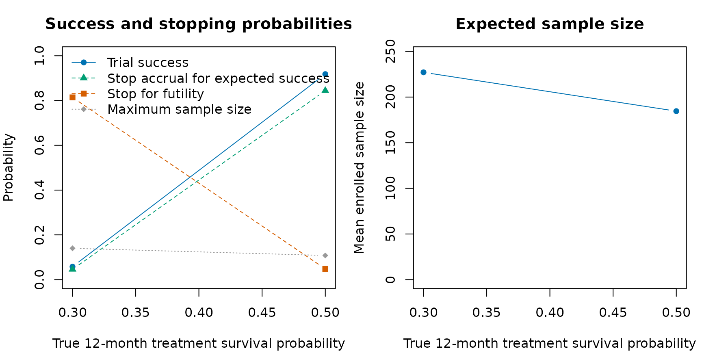
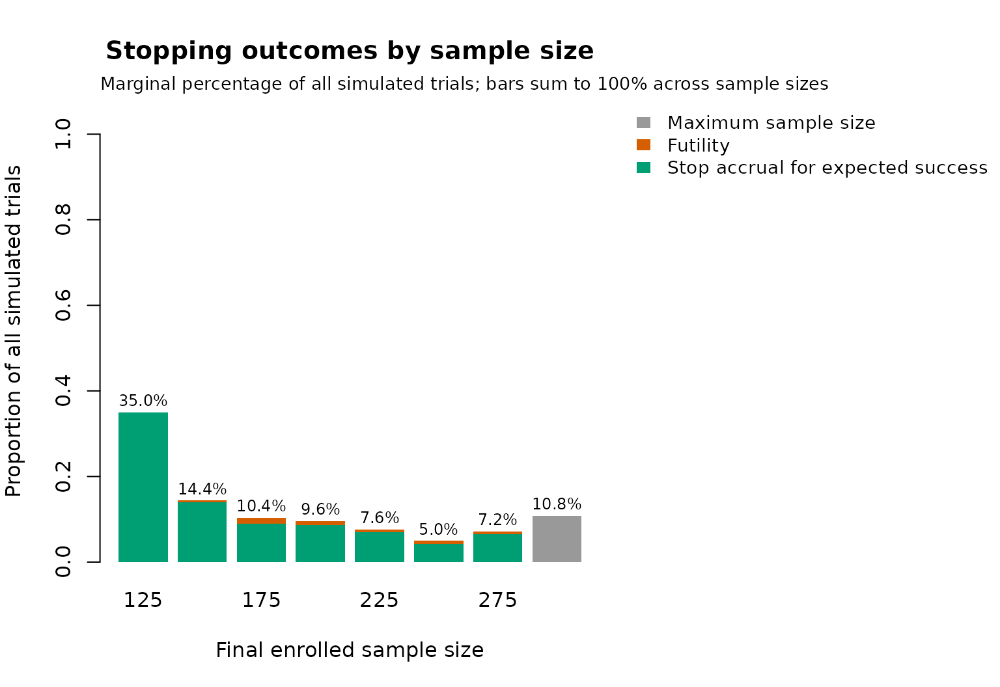
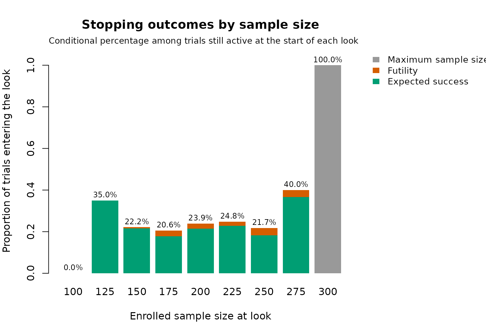
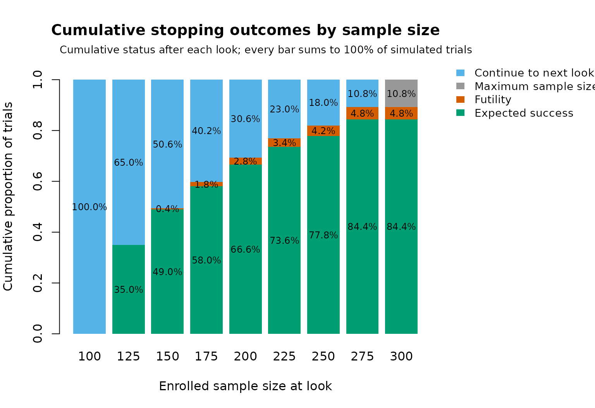

# Two-arm randomized trials

Broglio et al. (2014) presented an example from a hypothetical trial. We
will use a similar setup for this example, and break up the pieces to
make clear the argument choices for the package.

The setting is a two-arm randomized trial where patients are equally
randomized to either a control or a treatment arm. The primary endpoint
is overall survival (OS) measured from enrollment to death from any
cause or last follow-up. In `goldilocks`, enrollment time and
randomization time are treated as the same time point; in practice they
can differ, but that distinction is superfluous and therefore not
represented in the package simulator. The expected OS rate at 12-months
for the control arm is 30%. The minimum sample size is 100 and the
maximum sample size is 300. For simplicity, it is assumed that there is
no attrition. The maximum follow-up period for each subject is
12-months. This differs from the time-to-event example in Broglio et
al. (2014), which scheduled the primary analysis after accrual was
complete and all subjects had then completed 12 months of follow-up.
Thus, if accrual is stopped early for predicted success or the trial
continues accrual to the maximum sample size of 300 patients, the
primary analysis of OS will be conducted after each subject has
completed 12-months of follow-up.

From this information, we have:

- Equal randomization: `block = 2` and `rand_ratio = c(1, 1)` (default
  parameters)
- Primary endpoint is at 12-months: `end_of_study = 12`
- 12-month event rate for control arm:
  `hazard_control = prop_to_haz(1 - 0.30, endtime = 12)` (note that the
  input argument is the failure proportion, not the survival proportion)
- No change points in hazard: `cutpoints = NULL` (default parameter)
- Maximum sample size: `N_total = 300`
- No attrition: `prop_loss = 0`

Sample size selection analyses are planned starting when 100 patients
are enrolled and after every additional 25 patients are enrolled. Early
stopping for futility is allowed starting with the 100 patient sample
size selection analysis and F_n is 10%. Stopping accrual early for
predicted success is only allowed starting with the 200 patient sample
size selection analysis and S_n is 90%. It is expected that an average
of 5 patients per month will be enrolled, with no change in speed for
the duration of the trial.

Enrollment is stochastic even though the rate is constant. The package
fixes the first patient at calendar time zero and generates each later
inter-arrival gap from an exponential distribution with rate 5 per
month. Consequently, the expected time from the first to the 300th
enrollment is (300 - 1) / 5 = 59.8 months, but the realized completion
time differs between simulated trials. `lambda_time = NULL` indicates
that there are no internal enrollment-rate changes; zero is implicit and
must not be supplied.

For comparison, a ramp-up specification such as `lambda = c(2, 5)` and
`lambda_time = 6` assigns positive realized enrollment times in (0,6\]
to 2 expected enrollments per month and later times to 5 per month. The
first patient at zero is the fixed calendar origin. Fractional changes
such as `lambda_time = 6.5` are also simulated exactly. Enrollment-rate
knots use the trial calendar measured from first patient in, whereas
hazard `cutpoints` use each subject’s follow-up time measured from that
subject’s enrollment. The two schedules are independent and need not
share their knots.

From this information, we have:

- Interim sample size looks: `interim_look = seq(100, 275, 25)`
- Futility probability thresholds: `Fn = rep(0.10, 8)`
- Predicted success probability thresholds: `Sn = c(1, rep(0.9, 7))`
- `lambda = 5` and `lambda_time = NULL` (default parameter)

Note that the first value of `Sn` is 1. This is because the trial is not
allowed to stop for predicted success at the first interim analysis of n
= 100. The remaining elements of `Sn` are 0.9, corresponding to 90%.

The primary analysis is a two-sided log-rank test, with success declared
at the \alpha = 0.05 level.

From this information, we have:

- Two-sided log-rank test used: `alternative = "two.sided"` and
  `method = "logrank"`
- \alpha = 0.05 level used to declare success: `prob_ha = 0.95`

Note that `prob_ha` is set as 1 - 0.05. This allows us to interchange
between tests, including Bayesian tests (`method = "bayes-surv"`), which
requires an analogous posterior probability threshold. The parameter
`h0` is ignored when using a log-rank test, as it is not meaningful to
have success margins.

### One-sided tests

The example above uses a two-sided test. When the trial is designed to
detect a benefit in one direction only – here, longer survival on the
treatment arm – a one-sided test is often more appropriate. The `cox`
and `logrank` methods support all three alternatives via the
`alternative` argument. For these methods the direction is defined on
the hazard scale:

- `alternative = "less"` declares success when the treatment arm has a
  *lower* hazard (longer survival) than control.
- `alternative = "greater"` declares success when the treatment arm has
  a *higher* hazard.

For instance, to run the same design as a one-sided log-rank test at the
0.025 level, we would set:

``` r

out_power_1sided <- update(
  out_power,
  alternative = "less",
  prob_ha = 0.975
)
```

The frequentist binary risk-difference analysis (`method = "riskdiff"`)
supports all three alternatives and compares p\_\textrm{treatment} -
p\_\textrm{control} with `h0` using a Wald test. The Bayesian test
(`method = "bayes-surv"`) requires a one-sided alternative (`"less"` or
`"greater"`), and `"two.sided"` raises an error. For the Bayesian test
the effect is measured on the cumulative-failure-probability scale,
p\_\textrm{treatment} - p\_\textrm{control} at `end_of_study`, compared
against the margin `h0` (default `0`):

- `alternative = "less"` declares success when the posterior probability
  that p\_\textrm{treatment} - p\_\textrm{control} \< h_0 exceeds the
  threshold `prob_ha` – i.e. the treatment arm has a failure probability
  lower than the `h0` margin relative to control. With the default
  `h0 = 0`, this means lower failure probability (longer survival) than
  control.
- `alternative = "greater"` declares success when the posterior
  probability that p\_\textrm{treatment} - p\_\textrm{control} \> h_0
  exceeds `prob_ha`.

In all methods, `alternative = "less"` therefore corresponds to a
beneficial treatment effect (longer survival) in this example.

The operating characteristics will be determined using 500 simulated
trials. At each interim analysis, we will use 100 imputations and assume
independent weakly-informative \operatorname{Gamma}(0.1, 0.1) prior
distributions for the treatment and control arm event time hazard rate
parameters. As this is computationally expensive overall, we will
exploit the option to parallelize the simulations over multiple cores.

- Number of simulated trials: `N_trials = 500`
- Number of imputations from predictive distribution: `N_impute = 100`
- Independent prior distribution for each hazard rate parameter:
  `prior_surv = c(0.1, 0.1)`
- Parallel computation: `ncores = 8`. The default `backend = "auto"`
  uses serial execution for fewer than four trials and otherwise assigns
  at least two trials per worker, using forked workers on Unix-like
  platforms and PSOCK workers on Windows.
- Reproducible simulation streams: `seed = 123`

Similar to above, the parameter `N_mcmc` is not required when using a
log-rank test, meaning we do not need to enter a value for this
argument. Since we do not allow for attrition, the data at the final
analysis will be complete, and we can set `imputed_final = FALSE`. If
attrition occurred and `method = "cox"` or `method = "riskdiff"` were
selected, `imputed_final = TRUE` would analyze each completed dataset
and pool the scalar estimates and variances using Rubin’s rules; at
least two imputations are required. Imputed final analyses are not
available for `method = "logrank"`.

Initially, we want to determine the power to detect a significant
treatment effect when the OS rate at 12-months for the treatment arm is
50%.

``` r

library(goldilocks)
#> Loading required package: survival
```

``` r

hc <- prop_to_haz(0.7, endtime = 12)
ht <- prop_to_haz(0.5, endtime = 12)

out_power <- sim_trials(
  hazard_treatment = ht,
  hazard_control = hc,
  cutpoints = NULL,
  N_total = 300,
  lambda = 5,
  lambda_time = NULL,
  interim_look = seq(100, 275, 25),
  end_of_study = 12,
  prior_surv = c(0.1, 0.1),
  block = 2,
  rand_ratio = c(1, 1),
  prop_loss = 0,
  alternative = "two.sided",
  Fn = rep(0.10, 8),
  Sn = c(1, rep(0.9, 7)),
  prob_ha = 0.95,
  N_impute = 100,
  N_trials = 500,
  method = "logrank",
  ncores = 8,
  seed = 123)
```

On an Apple M2 Pro with 10 CPU cores, this workload took about 18
seconds with `ncores = 8` in a local run. Runtime will vary with
hardware, the number of workers, and system load.

It is straightforward to calculate the type I error under this design.
The only change required is to set the `hazard_treatment` argument to
the same as the `hazard_control` argument (i.e. the null case). We can
make use of the [`update()`](https://rdrr.io/r/stats/update.html)
function to avoid having to type everything else over again.

``` r

out_t1error <- update(out_power, hazard_treatment = hc, seed = 124)
```

``` r

initial_oc <- summarise_sims(list(out_power, out_t1error))
knitr::kable(
  initial_oc[c(
    "scenario",
    "n_requested",
    "n_used",
    "n_failed",
    "power",
    "stop_success",
    "stop_futility",
    "stop_max_N",
    "mean_N"
  )],
  digits = 3,
  caption = "Operating characteristics with a two-sided log-rank test at the 0.05 level. Scenario 1 is the alternative (treatment OS 50%); scenario 2 is the null (treatment OS 30%)."
)
```

| scenario | n_requested | n_used | n_failed | power | stop_success | stop_futility | stop_max_N | mean_N |
|:---|---:|---:|---:|---:|---:|---:|---:|---:|
| 1 | 500 | 500 | 0 | 0.934 | 0.864 | 0.030 | 0.106 | 180.6 |
| 2 | 500 | 500 | 0 | 0.062 | 0.044 | 0.754 | 0.202 | 236.6 |

Operating characteristics with a two-sided log-rank test at the 0.05
level. Scenario 1 is the alternative (treatment OS 50%); scenario 2 is
the null (treatment OS 30%). {.table}

The type I error under this design (scenario 2, `power` column) is
slightly too large to be considered acceptable. This was to be expected,
since we kept the P-value threshold as 0.05 despite having multiple
interim looks. The full `initial_oc` object also contains
`power_mc_lower` and `power_mc_upper`, which provide a 95% Wilson
interval for the finite-simulation Monte Carlo error.

In practice, we need to use a more stringent threshold in order to
control the overall type I error. This can be achieved by trial and
error. For example, if we use P \< 0.04 (applied using the argument
`prob_ha = 0.96`), we find the operating characteristics are more
acceptable.

``` r

out_power2 <- update(out_power, prob_ha = 0.96, return_trace = TRUE)
out_t1error2 <- update(
  out_power2,
  hazard_treatment = hc,
  return_trace = FALSE,
  seed = 125
)
```

``` r

oc_calibrated <- summarise_sims(list(
  "target: treatment OS 50%" = out_power2,
  "null: treatment OS 30%" = out_t1error2
), max_mcse = c(power = 0.02, mean_N = 3))

format_mc_interval <- function(estimate, lower, upper, digits = 3) {
  format_string <- paste0(
    "%.", digits, "f [%.", digits, "f-%.", digits, "f]"
  )
  sprintf(format_string, estimate, lower, upper)
}
oc_calibrated_display <- data.frame(
  scenario = oc_calibrated$scenario,
  simulations = sprintf(
    "%d/%d (%d)",
    oc_calibrated$n_used,
    oc_calibrated$n_requested,
    oc_calibrated$n_failed
  ),
  power = format_mc_interval(
    oc_calibrated$power,
    oc_calibrated$power_mc_lower,
    oc_calibrated$power_mc_upper
  ),
  expected_success = format_mc_interval(
    oc_calibrated$stop_success,
    oc_calibrated$stop_success_mc_lower,
    oc_calibrated$stop_success_mc_upper
  ),
  futility = format_mc_interval(
    oc_calibrated$stop_futility,
    oc_calibrated$stop_futility_mc_lower,
    oc_calibrated$stop_futility_mc_upper
  ),
  maximum_N = format_mc_interval(
    oc_calibrated$stop_max_N,
    oc_calibrated$stop_max_N_mc_lower,
    oc_calibrated$stop_max_N_mc_upper
  ),
  mean_N = format_mc_interval(
    oc_calibrated$mean_N,
    oc_calibrated$mean_N_mc_lower,
    oc_calibrated$mean_N_mc_upper,
    digits = 1
  )
)
knitr::kable(
  oc_calibrated_display,
  col.names = c(
    "Scenario",
    "Used/requested (failed)",
    "Power [95% MC CI]",
    "Expected success [95% MC CI]",
    "Futility [95% MC CI]",
    "Maximum N [95% MC CI]",
    "Mean N [95% MC CI]"
  ),
  caption = "Operating characteristics with the more stringent P < 0.04 threshold (`prob_ha = 0.96`)."
)
```

| Scenario | Used/requested (failed) | Power \[95% MC CI\] | Expected success \[95% MC CI\] | Futility \[95% MC CI\] | Maximum N \[95% MC CI\] | Mean N \[95% MC CI\] |
|:---|:---|:---|:---|:---|:---|:---|
| null: treatment OS 30% | 500/500 (0) | 0.058 \[0.041-0.082\] | 0.046 \[0.031-0.068\] | 0.814 \[0.778-0.846\] | 0.140 \[0.112-0.173\] | 227.1 \[223.2-230.9\] |
| target: treatment OS 50% | 500/500 (0) | 0.918 \[0.891-0.939\] | 0.844 \[0.810-0.873\] | 0.048 \[0.032-0.070\] | 0.108 \[0.084-0.138\] | 184.6 \[179.1-190.0\] |

Operating characteristics with the more stringent P \< 0.04 threshold
(`prob_ha = 0.96`). {.table}

Here, “95% MC CI” means a Monte Carlo confidence interval: it describes
how precisely this finite batch estimates the operating characteristic
under the fixed simulation assumptions. It is **not a clinical
confidence interval for the treatment effect** and does not represent
uncertainty in the assumed event, accrual, or loss-to-follow-up models.
Probability intervals use the Wilson method, while mean sample size uses
a t interval based on its Monte Carlo standard error. The optional
`max_mcse` argument warns when a named precision target is not met; it
does not change the simulations or estimates.

In the cached 500-trial simulation, assuming the treatment arm has an OS
rate of 50% at 12 months, 84.4% of trials stopped early for expected
success, 4.8% stopped early for futility, and the mean sample size was
184.6. Overall power was 91.8%. When the treatment-arm OS rate equalled
the control-arm rate, 81.4% of trials stopped early for futility. Larger
calibration runs are appropriate for final design decisions when the
displayed Monte Carlo precision is insufficient.

The same simulation can be summarized on the calendar-time scale without
adding any design arguments. Time zero is first patient enrolled, and
the time unit is months in this example. “Analysis ready” is when the
last observed event or censoring required for the final analysis becomes
available; it does not include an external allowance for data cleaning
or database lock. The percentage in the trials column uses all requested
simulations as its denominator, so failed and excluded simulations
cannot silently disappear.

``` r

calendar_oc <- summarise_calendar_time(out_power2)
calendar_duration <- calendar_oc$trial_duration
calendar_duration$trials <- sprintf(
  "%d (%.1f%%)",
  calendar_duration$n_trials,
  calendar_duration$percent_trials
)
calendar_duration$accrual <- sprintf(
  "%.1f [%.1f-%.1f]",
  calendar_duration$accrual_stop_median,
  calendar_duration$accrual_stop_p10,
  calendar_duration$accrual_stop_p90
)
calendar_duration$analysis_ready <- sprintf(
  "%.1f [%.1f-%.1f]",
  calendar_duration$analysis_ready_median,
  calendar_duration$analysis_ready_p10,
  calendar_duration$analysis_ready_p90
)
knitr::kable(
  calendar_duration[c(
    "stopping_reason",
    "trials",
    "mean_N",
    "accrual",
    "analysis_ready",
    "followup_person_time_mean",
    "peak_active_followup_mean"
  )],
  digits = 1,
  col.names = c(
    "Stopping reason",
    "Trials, n (%)",
    "Mean enrolled",
    "Accrual stopped, median [P10-P90]",
    "Analysis ready, median [P10-P90]",
    "Mean person-months",
    "Mean peak under follow-up"
  ),
  caption = "Calendar-time duration and follow-up burden under the treatment-effect scenario."
)
```

| Stopping reason | Trials, n (%) | Mean enrolled | Accrual stopped, median \[P10-P90\] | Analysis ready, median \[P10-P90\] | Mean person-months | Mean peak under follow-up |
|:---|:---|---:|:---|:---|---:|---:|
| expected_success | 422 (84.4%) | 168.4 | 30.2 \[23.3-49.7\] | 41.9 \[34.7-61.2\] | 1314.5 | 48.9 |
| futility | 24 (4.8%) | 209.4 | 39.9 \[31.6-51.9\] | 51.8 \[43.6-63.3\] | 1631.2 | 51.1 |
| maximum_sample_size | 54 (10.8%) | 300.0 | 60.6 \[55.5-64.2\] | 71.9 \[67.4-76.1\] | 2338.2 | 51.8 |
| overall | 500 (100.0%) | 184.6 | 32.2 \[23.5-57.6\] | 44.0 \[35.2-69.0\] | 1440.3 | 49.3 |

Calendar-time duration and follow-up burden under the treatment-effect
scenario. {.table}

Because `out_power2` was simulated with `return_trace = TRUE`, a second
wide table describes when each interim look was reached and how many
subjects were actively under follow-up at that time. A trial that stops
before a later look remains in the requested denominator but does not
contribute a timing value at that look.

``` r

calendar_interim <- calendar_oc$interim_timing
calendar_interim$reached <- sprintf(
  "%d (%.1f%%)",
  calendar_interim$n_reached,
  calendar_interim$percent_reached
)
calendar_interim$calendar_time <- sprintf(
  "%.1f [%.1f-%.1f]",
  calendar_interim$calendar_time_median,
  calendar_interim$calendar_time_p10,
  calendar_interim$calendar_time_p90
)
calendar_interim$active_followup <- sprintf(
  "%.0f [%.0f-%.0f]",
  calendar_interim$active_followup_median,
  calendar_interim$active_followup_p10,
  calendar_interim$active_followup_p90
)
knitr::kable(
  calendar_interim[c(
    "look",
    "planned_N",
    "reached",
    "calendar_time",
    "active_followup"
  )],
  col.names = c(
    "Look",
    "Planned N",
    "Reached, n (%)",
    "Calendar month, median [P10-P90]",
    "Active follow-up, median [P10-P90]"
  ),
  caption = "Calendar timing and concurrent follow-up at each interim look."
)
```

| Look | Planned N | Reached, n (%) | Calendar month, median \[P10-P90\] | Active follow-up, median \[P10-P90\] |
|---:|---:|:---|:---|:---|
| 1 | 100 | 500 (100.0%) | 19.5 \[17.4-22.2\] | 40 \[32-48\] |
| 2 | 125 | 500 (100.0%) | 24.7 \[22.0-27.7\] | 40 \[32-49\] |
| 3 | 150 | 325 (65.0%) | 29.8 \[26.7-32.5\] | 40 \[32-48\] |
| 4 | 175 | 253 (50.6%) | 34.8 \[31.1-37.8\] | 40 \[33-48\] |
| 5 | 200 | 201 (40.2%) | 40.0 \[36.0-43.2\] | 40 \[33-47\] |
| 6 | 225 | 153 (30.6%) | 45.1 \[41.2-47.8\] | 40 \[32-48\] |
| 7 | 250 | 115 (23.0%) | 50.2 \[46.0-53.5\] | 40 \[33-48\] |
| 8 | 275 | 90 (18.0%) | 55.2 \[51.0-59.1\] | 40 \[33-48\] |

Calendar timing and concurrent follow-up at each interim look. {.table}

The same results can be viewed graphically.
[`plot_sim_ocs()`](https://graemeleehickey.github.io/goldilocks/reference/plot_sim_ocs.md)
compares final success, stopping behavior, and expected sample size
across the treatment-effect scenarios. Because the meaning and direction
of an effect depends on the chosen analysis, the effect scale is
supplied explicitly; here it is the true 12-month treatment survival
probability.

``` r

oc_calibrated$true_treatment_survival <- c(0.50, 0.30)
plot_sim_ocs(
  oc_calibrated,
  effect = "true_treatment_survival",
  xlab = "True 12-month treatment survival probability"
)
```



For a single scenario,
[`plot_sim_stopping()`](https://graemeleehickey.github.io/goldilocks/reference/plot_sim_stopping.md)
can show four complementary views. The default marginal view gives each
outcome as a percentage of all simulated trials. The conditional view
uses only trials still active when each look begins as its denominator,
while the cumulative view shows the status of all trials after every
look and includes those continuing to the next look. A flowchart view
displays counts moving from the total simulation set through futility,
continued enrollment, and early success at successive looks. Because
`out_power2` retains simulation traces, the latter three views include
reached looks even when no trial stopped at that look. Percentage labels
use a compact size so values at adjacent looks remain visually distinct.

``` r

plot_sim_stopping(out_power2)
```



``` r

plot_sim_stopping(out_power2, type = "conditional")
```



``` r

plot_sim_stopping(out_power2, type = "cumulative")
```



``` r

plot_sim_stopping(out_power2, type = "flowchart")
```

The predictive-probability decision map requires traces from every
simulated trial. These are opt-in because they increase the size of the
simulation result:

``` r

plot_sim_decisions(out_power2)
```

Each decision-map panel represents an interim look. The horizontal
coordinate is the predictive probability of success after continuing to
the maximum sample size; the vertical coordinate is the predictive
probability if enrollment stops now. Shading and dashed lines show the
continuation, futility, and expected-success regions.

Once we have identified a suitable design, we would typically re-run the
simulations using a larger number of simulations and, perhaps,
imputations.

## References

Broglio KR, Connor JT, Berry SM. Not too big, not too small: a
Goldilocks approach to sample size selection. *Journal of
Biopharmaceutical Statistics*, 2014; **24(3)**: 685–705.
